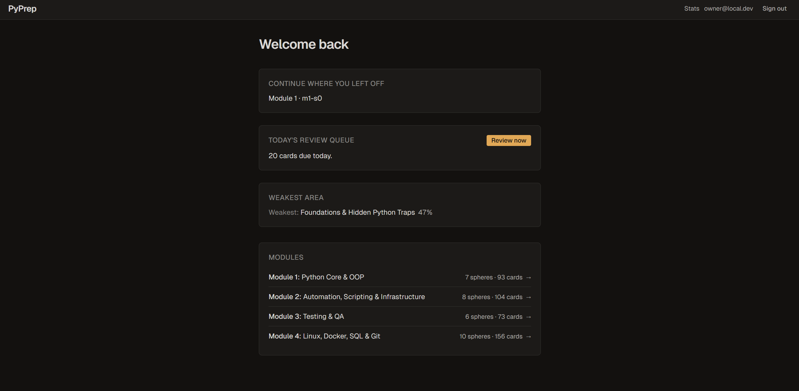
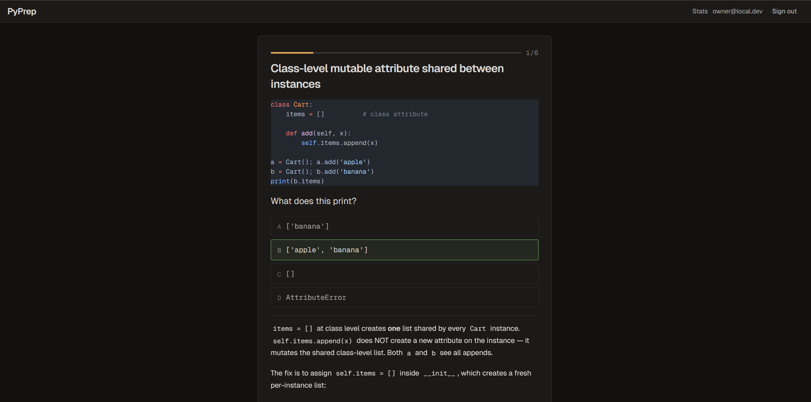
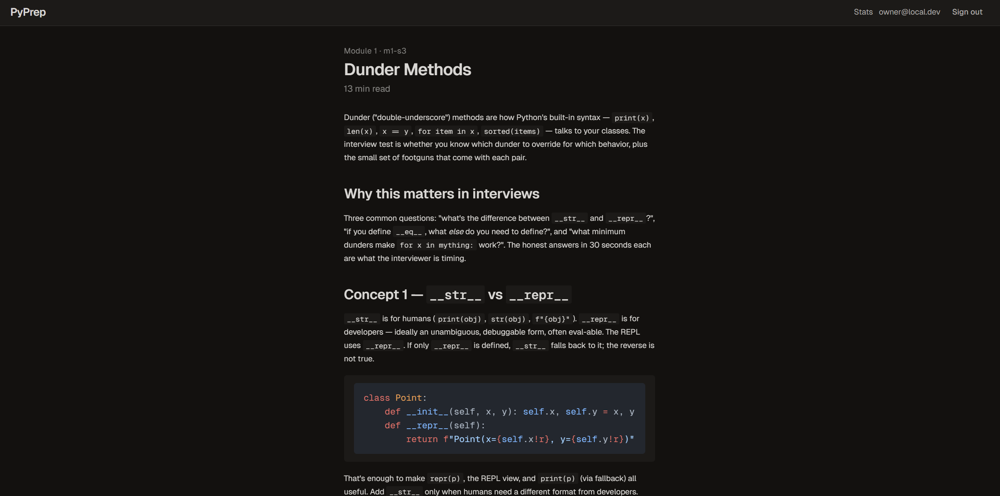
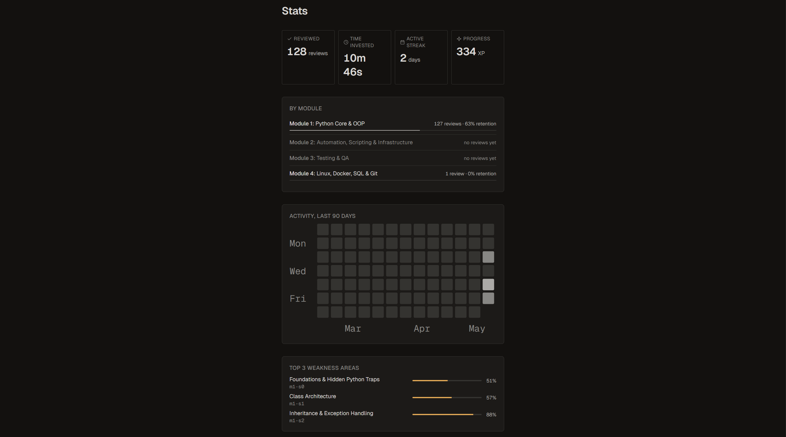

# PyPrep

> **Active recall + spaced repetition + in-browser code execution — purpose-built for Israeli junior Python interviews.**

PyPrep is a focused web app that takes a CS graduate from "I can build with AI" to "I can pass a Python live-coding interview" in 4–6 weeks of daily use. It is not a tutorial, not a Duolingo clone, not a LeetCode replacement.

---

## What's inside

- 📚 **426 cards across 4 modules, 31 spheres** — Python Core & OOP (M1, 93 cards), Automation & Scripting (M2, 104), Testing & QA (M3, 73), Linux / Docker / SQL / Git (M4, 156). Every card hand-authored against interview-discriminating mechanism gotchas; zero LLM-generated drift.
- 🎴 **Five card types** — flip cards, code traps ("what does this print?"), multiple choice with non-obvious answers, fill-in-the-blank, and full code tasks with hidden `pytest` validation.
- 💻 **In-browser code execution** — Pyodide runs real Python in a Web Worker. Hidden tests execute client-side. No server-side `exec`. No security risk. No signup gate to run code.
- 🧠 **FSRS spaced repetition** — modern memory model schedules each card to resurface right before you'd forget.
- 📊 **Honest weakness dashboard** — ranks topics by where you actually struggle. No streak shaming. No XP. No flame emoji.

## Screenshots

**Daily dashboard** — your review queue, weakest area, and module grid.


**Active session** — Multiple-Choice card with code, options, and revealed explanation.


**Lesson view** — long-form interview-prep explainer with syntax-highlighted code.


**Stats** — KPI tiles, per-module retention, 90-day activity heatmap, weakness areas.


---

## Status

**MVP-1 — feature-complete, pre-ship packaging in progress.** 426 cards across 4 modules; FSRS spaced repetition; in-browser Pyodide pytest harness; 10 pre-push gates enforce code, content, accessibility, contrast, typography, and bundle-size discipline. See `docs/TODO.md` for live progress.

---

## Quick Start (local dev)

### Prerequisites

- Python 3.11+
- Node 20+ and pnpm 9+
- `uv` (Astral's Python package manager) — install: `curl -LsSf https://astral.sh/uv/install.sh | sh`
- Docker + Docker Compose (optional, for one-command dev)

### Install & run

```bash
# 1. clone and enter
git clone https://github.com/ilyalaz01/pyprep.git
cd pyprep

# 2. backend
uv sync                              # install all Python deps from pyproject.toml + uv.lock
cp .env-example .env                 # adjust if needed

# 3. frontend (env.local is gitignored; vite reads VITE_* at start only)
cd frontend && pnpm install && cp .env.example .env.local && cd ..

# 4. one-time per clone: pre-push hook (mirrors CI gates locally)
uv run pre-commit install --hook-type pre-push

# 5. run (two processes — backend on 8000, frontend on 5173)
uv run pyprep-api                    # terminal 1
pnpm --dir frontend dev              # terminal 2
```

Open `http://localhost:5173`. Default single-user mode is enabled — no registration screen.

> **Database migrations run automatically on app startup.** No manual
> `alembic upgrade head` is needed for dev or prod — the FastAPI lifespan
> hook brings the schema to head every boot (idempotent). See
> `src/pyprep/api/lifespan.py` and `PLAN.md` ADR-012.

---

## Configuration

All settings via environment variables. See `.env-example` for the full list. Highlights:

| Variable | Default | Effect |
|---|---|---|
| `PYPREP_SINGLE_USER` | `true` | Skip registration; auto-login as the configured user |
| `PYPREP_DATABASE_URL` | `sqlite:///./pyprep.db` | DB connection string |
| `PYPREP_SECRET_KEY` | _required_ | JWT signing secret (≥ 32 chars) |
| `PYPREP_FSRS_REQUEST_RETENTION` | `0.9` | Target retrievability for next review |
| `PYPREP_DAILY_NEW_CARD_CAP` | `15` | Max new cards introduced per day |

---

## Usage

### Daily flow (recommended)

1. Open the app. Home shows today's review queue (FSRS-scheduled) and your top 3 weakness topics.
2. Hit **Review now** — work through due cards (~10–20 mins).
3. If the queue is short, follow a **weakness topic** link — practice that sphere.

### Card session

- **Space** — flip / reveal answer.
- **1 / 2 / 3 / 4** — rate `Again` / `Hard` / `Good` / `Easy` (FSRS rating).
- **Enter** — next card.

---

## Architecture (one diagram)

```
   Browser                     Backend                Storage
   ────────                    ────────               ───────
   ┌────────────┐  HTTPS       ┌───────────────┐      ┌─────────┐
   │  React SPA │ ───────────► │  FastAPI API  │────► │ SQLite  │
   │  + Pyodide │              │  + Core SDK   │      │ /Postgres│
   └────────────┘              └───────────────┘      └─────────┘
        │                              │
        │                              ▼
        │                       ┌───────────────┐
        │                       │  content/     │
        │                       │  Markdown +   │
        │                       │  JSON cards   │
        └─ runs Python code ────┘               
           in Web Worker
```

Full architecture: `docs/PLAN.md` (C4 diagrams, ADRs).

---

## Development

```bash
# run tests
uv run pytest --cov                  # coverage gate ≥ 85%

# lint & format
uv run ruff check .
uv run ruff format .

# type-check (strict on SDK + API per pyproject.toml [tool.mypy].files)
uv run mypy

# validate content
uv run validate-content

# frontend
pnpm --dir frontend lint
pnpm --dir frontend exec tsc -b
pnpm --dir frontend test
```

### Pre-push gates (10/10)

A `pre-push` git hook runs the full suite locally — same checks CI enforces. Any failure blocks the push.

| # | Gate | Scope |
|---|---|---|
| 1 | `ruff` lint | backend Python |
| 2 | `mypy` strict | SDK + API |
| 3 | File size ≤ 150 LOC | `src/` |
| 4 | Handler logic ≤ 10 LOC | API handlers (NOTES-waivered exceptions only) |
| 5 | ESLint | frontend |
| 6 | `tsc -b` | frontend (build-mode catches lib/refs mismatches) |
| 7 | WCAG AA contrast | theme tokens |
| 8 | Em-dash content lint | no U+2014 in shipped content/code copy |
| 9 | Vite env coverage | `VITE_*` references must exist in `.env-example` |
| 10 | Bundle size | raw ≤ 2 MB, gzip ≤ 600 KB (per ADR-022) |

One-time install per clone: `uv run pre-commit install --hook-type pre-push`.

---

## Production build

Single-image multi-stage Docker build:

```bash
docker build -t pyprep:latest .

docker run --rm -p 8000:8000 \
  -v $(pwd)/data:/data \
  -e PYPREP_SECRET_KEY="$(openssl rand -hex 48)" \
  -e PYPREP_SINGLE_USER=true \
  -e PYPREP_SINGLE_USER_PASSWORD=change-me \
  pyprep:latest
```

Open `http://localhost:8000`. SQLite database persists in `./data/pyprep.db`.

Architecture: FastAPI serves API at `/api/*` and built frontend at `/` from the same origin (ADR-012). Single container, no CORS surface, no nginx layer for MVP-1.

Full deploy guide (host options, secrets management, persistence strategy): see `docs/DEPLOY.md` (forthcoming, Phase 10 ship-packaging T10.4).

---

## Project Documentation

All design decisions are captured before code. The docs are part of the artifact.

| Doc | Purpose |
|---|---|
| `docs/PRD.md` | What we're building, for whom, why, KPIs |
| `docs/PLAN.md` | How — C4 diagrams, ADRs, data model |
| `docs/TODO.md` | Phased task list, current status |
| `docs/PRD_spaced_repetition.md` | FSRS algorithm spec |
| `docs/PRD_code_sandbox.md` | Pyodide execution spec + card-authoring constraints |
| `docs/PRD_progress_tracking.md` | Stats & weakness detection |
| `docs/PRD_content_authoring.md` | Content schema & authoring rules |

Internal: `docs/CLAUDE_CODE_INSTRUCTIONS.md` (agent-driving conventions) and `docs/PRD_mock_interview_prompts.md` (deprecated per ADR-028; implementation removed in Phase 10 ship-packaging — PRD retained as historical artifact).

---

## Contributing

Single contributor at MVP (the project owner). Public contribution post-launch.

---

## License

MIT — see `LICENSE`.

## Credits

- [Pyodide](https://pyodide.org/) — Python in WebAssembly.
- [py-fsrs](https://github.com/open-spaced-repetition/py-fsrs) — FSRS algorithm reference implementation.
- [FastAPI](https://fastapi.tiangolo.com/), [React](https://react.dev/), [Tailwind](https://tailwindcss.com/), [TanStack](https://tanstack.com/).
- Curriculum source: project owner's interview-prep notes (Modules 1–4).

## Provenance

Process framework based on Dr. Yoram Segal's Software Project Guidelines v3.00 — design-before-code discipline, decision logs, file-size and complexity ceilings.
