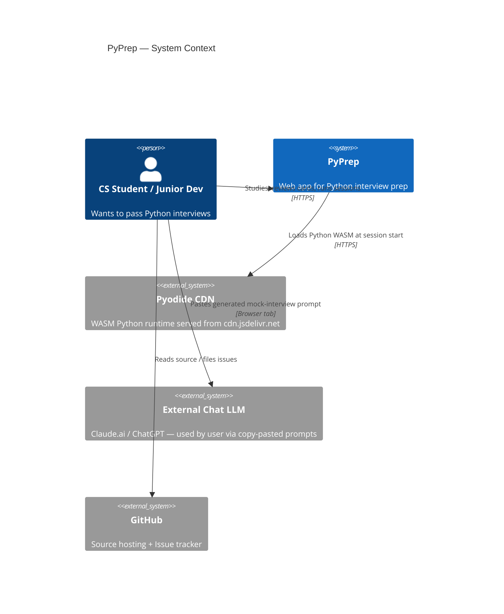
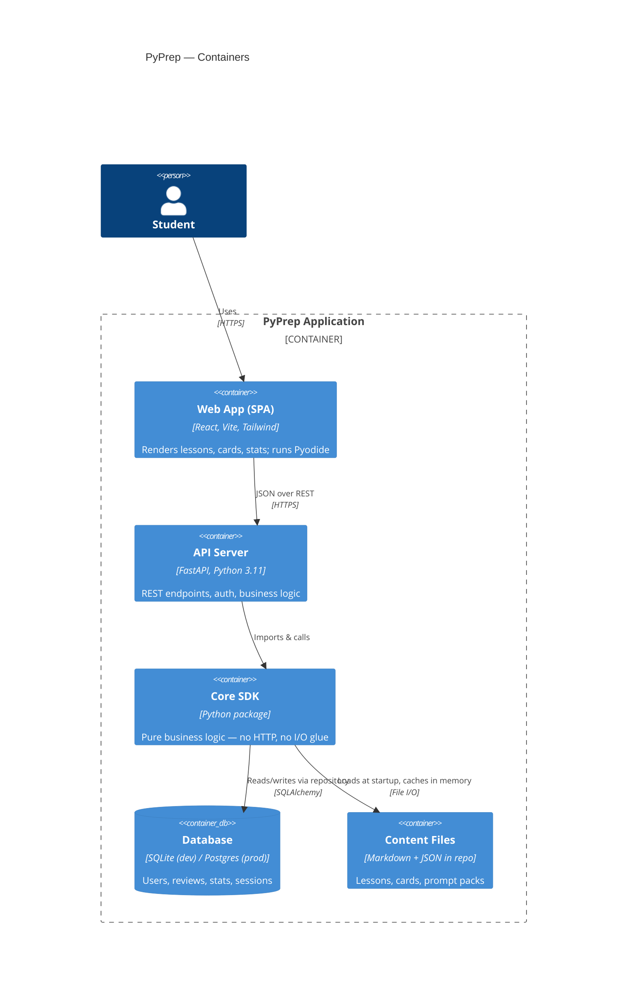
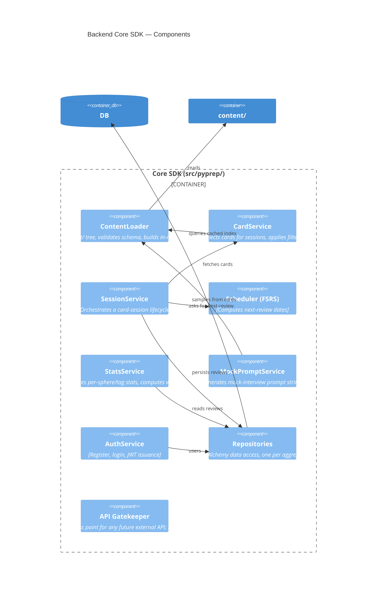
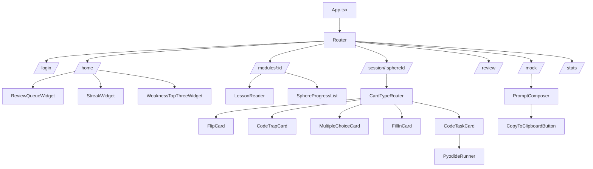
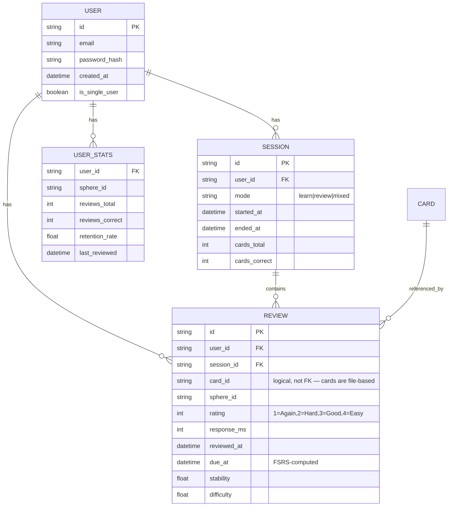
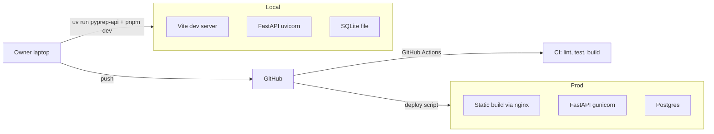

# PyPrep — Architecture & Design Document (PLAN)

**Version:** 1.00
**Companion to:** `PRD.md`
**Last updated:** 2026-05-07

---

## 1. C4 Model — Level 1: System Context



**Key insight:** PyPrep does not call any paid LLM API. The mock interview feature generates text prompts the user pastes into their own LLM browser tab.

---

## 2. C4 Model — Level 2: Containers



---

## 3. C4 Model — Level 3: Backend Components (Core SDK)



### 3.1 SDK Layer Rule (Segal §3.1)

All consumers — REST handlers, future CLI, tests — talk to the SDK. **No** business logic lives in REST handlers. A handler should be at most ~10 lines: parse request → call SDK → format response.

---

## 4. Frontend Architecture



### 4.1 State Management

- **Server state**: TanStack Query for everything from the API.
- **UI state**: React local state + a small Zustand store for cross-route ephemeral state (current session progress).
- **No Redux.** Overkill for this scope.

### 4.2 Pyodide Loading Strategy

- Lazy-load Pyodide only when a route that needs it is opened (`/session/...` for code tasks).
- Cache the loaded interpreter for the SPA lifetime.
- Run user code + hidden `pytest` harness in a Web Worker to keep main thread responsive.

---

## 5. Data Model



**Card content is NOT stored in the DB.** Cards live in `content/` as files, loaded once at startup and addressed by stable string IDs. This keeps content version-controlled in Git and editable without DB migrations.

**FK ON DELETE behavior** (T2.10): user-rooted aggregates use
`ON DELETE CASCADE`. Deleting a `User` row cascades through
`sessions` (where `user_id` FKs to `users.id`) and `reviews` (where
both `user_id` and `session_id` FK with cascade). This is the
GDPR-aligned default — full account wipe on user deletion. SQLite
enforces FKs only when `PRAGMA foreign_keys=ON` is set per-connection;
Postgres enforces unconditionally. The Phase 3 DB-init code is
responsible for setting the SQLite pragma.

**`USER_STATS` is intentionally not built.** PRD progress §3.3
supersedes the `USER_STATS` row in the diagram above: stats are
computed on-the-fly from `reviews` at MVP. Materialized views are
post-MVP.

---

## 6. Architectural Decision Records (ADRs)

### ADR-001: Pyodide for code execution, not server-side `exec`

**Status:** Accepted

**Context:** Users will write and run Python code as part of code-task cards. The two viable approaches: server-side execution in a sandbox (Docker container per user), or client-side via Pyodide (Python compiled to WASM, runs in browser).

**Decision:** Client-side via Pyodide. No server-side execution under any circumstances.

**Rationale:**
- Zero attack surface from user code on the server.
- Zero infra cost for code execution.
- pytest-via-Pyodide works (proven by JupyterLite and similar projects).
- Initial Pyodide load (~10 MB) is acceptable for a focused study session.

**Trade-offs:**
- Some Python packages don't work in Pyodide (compiled extensions). Mitigated: code-task cards target stdlib + a curated allowlist.
- First load is slow. Mitigated: lazy-load only on code-task routes; cache for session.

### ADR-002: FSRS over SM-2 for spaced repetition

**Status:** Accepted

**Context:** Spaced repetition algorithm choice. SM-2 (used by Anki classic) is well-known; FSRS (Free Spaced Repetition Scheduler) is a modern ML-fit replacement now also used by Anki.

**Decision:** FSRS via the `fsrs` library (PyPI; GitHub repo: open-spaced-repetition/py-fsrs).

**Rationale:**
- FSRS is more accurate per published benchmarks; produces fewer wasted reviews.
- It is the current default in modern Anki, so users with prior Anki habits map cleanly.
- `fsrs` is small, well-tested, and pure Python.

**Trade-offs:**
- Slightly more state per review (stability + difficulty floats). Acceptable.
- Algorithm is harder to explain in interviews than SM-2. Acceptable — we wrap it in `Scheduler` interface.

### ADR-003: SQLite for dev, Postgres path for prod

**Status:** Accepted

**Context:** Choose persistent store. Options: SQLite, Postgres, MongoDB.

**Decision:** SQLAlchemy ORM with SQLite for local single-user mode and Postgres-compatible URL support for shared deployments.

**Rationale:**
- SQLite is zero-config for the owner's local install.
- SQLAlchemy abstraction keeps the upgrade path to Postgres trivial.
- No NoSQL fit — data is highly relational (users, reviews, sessions).

### ADR-004: Content as files, not DB rows

**Status:** Accepted

**Context:** Where do lessons and cards live?

**Decision:** Markdown for lessons, JSON for card definitions, in `content/` directory under version control.

**Rationale:**
- Content is editable in any IDE; no admin UI needed for MVP.
- Diff-able in Git, reviewable as PRs.
- Loaded once into in-memory index at server start; query is O(1).
- Avoids building an admin CMS, which would double the project scope.

**Trade-offs:**
- Non-technical contributors can't edit content. Acceptable — the only contributor at MVP is the owner.

### ADR-005: Mock interview as prompt generator, not as in-app LLM call

**Status:** Accepted (per owner directive)

**Context:** Mock interviews would normally require an LLM API call.

**Decision:** Generate the prompt text and let the user paste it into their own Claude/ChatGPT browser tab.

**Rationale:**
- Zero API cost.
- User reuses an existing chat subscription.
- Prompt quality > model choice at this scale.
- No API key management, no rate limits, no cost monitoring.

**Trade-offs:**
- UX is slightly less polished (copy-paste step). Mitigated: clear "How to use" panel.
- App cannot grade the mock. Acceptable — the LLM acts as judge.

### ADR-006: `uv` as the only package manager

**Status:** Accepted (Segal §16.4)

**Context:** Python tooling: pip, poetry, pdm, uv, conda.

**Decision:** `uv` exclusively.

**Rationale:**
- Mandated by Segal guidelines.
- Fastest installer in the ecosystem.
- Lockfile (`uv.lock`) ensures reproducibility.
- One tool for venv + install + lock + run.

### ADR-007: FastAPI over Flask/Django

**Status:** Accepted

**Context:** Backend framework.

**Decision:** FastAPI.

**Rationale:**
- Owner's existing stack (Digi-Ktav was FastAPI).
- Type-hint native; Pydantic models = free request validation.
- Async support if needed later.
- OpenAPI docs auto-generated → useful as portfolio artifact.

### ADR-008: React + Vite + TanStack Query + Tailwind, no UI kit

**Status:** Accepted

**Context:** Frontend framework + state + styling.

**Decision:** React 18, Vite, TanStack Query for server state, Tailwind for styling. No Material-UI / Ant Design / Chakra.

**Rationale:**
- Owner's existing stack.
- UI kits add weight and constrain custom card animations (flip).
- Tailwind + a small in-house component library is sufficient.

### ADR-010: Stateless session server; client owns queue progression

**Status:** Accepted

**Context:** During a card session, *something* has to track which card the user is currently on, the order of remaining cards, and the FR-REVIEW-3 rule that AGAIN-rated cards re-enter the queue at end of session. Two designs are viable: (a) server-authoritative — `SessionService` owns a mutable in-memory queue per session, every `submit` advances it, every refresh re-fetches the next card; (b) stateless — the server picks the initial queue at `start`, records each `Review` event independently, and the SPA owns progression and re-Again ordering.

**Decision:** Stateless. The server is an event-sink for `Review` rows. The SPA owns queue ordering and the AGAIN-reinsertion loop.

**Rationale:**
- **Hard Rule 2 thin handlers.** Server-authoritative queues would push handlers past the ~10-LOC budget once you add session-locking, queue-snapshot persistence, and stale-cursor guards.
- **Single-user MVP.** No adversarial attacker model — there is no incentive for the user to deviate from their assigned queue, and no leaderboard or competitive context where deviation would be cheating.
- **Trivial crash recovery.** A page refresh re-requests `/api/review/queue` (or re-runs `start`) — no server-side cursor to reconcile.
- **FR-REVIEW-3 is a "what to show next" concern, not a business invariant.** The truth-of-record is the `Review` row's rating; queue ordering is a UX concern.

**Trade-offs (accepted explicitly):**
- Clients **can** deviate from the picked-at-start `Session.queue` — submit a card not in the queue, skip cards, etc. Server validates the card_id exists and the session is open; that's it.
- `mixed` mode (FR-REVIEW-4 daily-new-card cap + FR-STATS-2 weakness-rank input) is the one place this approximation might bite, because the cap should be an authoritative invariant, not a suggestion. Flagged for re-examination once StatsService lands at T2.5 and queue assembly hits real complexity.

**Revisit when:**
- (a) Multi-user public mode ships and an adversarial attacker model exists.
- (b) Competitive / leaderboard features need anti-cheat invariants.
- (c) Audit-trail requirements force "what cards did the user see and in what order".

Until any of these triggers, stateless stays.

> **ADR-013 amendment (Pyodide trust boundary review trigger):** ADR-010
> already accepts that the SPA can lie to itself (queue deviation). The
> Pyodide pass/fail signal for code-task cards is also client-reported;
> a determined user could submit a fake `RunResult { ok: true }` from
> the browser console. **When competitive/multi-user features
> (leaderboards, public sharing of mock-interview results) are
> introduced, this ADR MUST be revisited.** Two options at that point:
> server-side re-execution under allowlist (a sandbox that re-runs the
> hidden harness against the submitted user_code), OR cryptographic
> attestation of the in-browser run (signed RunResult with a server-
> side nonce). Until any of ADR-010's triggers fire, we accept that the
> client is the source of truth for code-task outcomes — same trade-off
> as queue progression, single-user MVP rationale.

---

### ADR-009: FSRS fuzzing disabled for output determinism

**Status:** Accepted

**Context:** `fsrs.Scheduler` defaults to `enable_fuzzing=True`, which jitters the next due-date by a small random offset. PRD `PRD_spaced_repetition.md` §2.5 requires byte-identical output for identical input — golden vectors and snapshot tests depend on it.

**Decision:** `FSRSScheduler` instantiates the underlying scheduler with `enable_fuzzing=False`. The choice is hard-coded in the wrapper, not configurable.

**Rationale:**
- Determinism is a stronger property than load-spreading at our scale (single-digit users in MVP).
- Snapshot/golden tests (PRD §4.3) require byte-identical replay.
- Stability/difficulty trajectories are still produced by FSRS-6's actual algorithm — only the per-due jitter is suppressed.

**Trade-offs:**
- At high scale (many users × thousands of cards), unjittered due-dates may cluster review load on the same UTC days. Mitigation if/when that becomes real: re-enable fuzzing with a deterministic per-user seed (pass a seed into the scheduler so identical-user-identical-card replay still matches snapshots).

---

### ADR-011: JWT in localStorage for MVP-1 (single-user, self-hosted)

**Status:** Accepted (added Phase 3.5 — owner verdict)

**Context:** The SPA needs to store the bearer token between page loads.
Two viable strategies:
1. **localStorage** — synchronous, simple, but XSS-extractable.
2. **httpOnly cookie + CSRF middleware** — XSS-safe (token not reachable
   from JS) but requires a full CSRF protection layer (double-submit
   token, SameSite=strict tuning, OPTIONS-preflight handling).

**Decision:** localStorage for MVP-1.

**Rationale:**
- Single-user, self-hosted on the owner's laptop. No XSS surface that an
  attacker could realistically reach.
- httpOnly+CSRF would add ~1 day of cookie/CSRF middleware work — disproportionate
  for a single-user app whose only client is the owner.
- Migration path is well-trodden: switch the token issuance to
  `Set-Cookie: HttpOnly; Secure; SameSite=Strict`, add CSRF token
  middleware, change SPA fetch to `credentials: "include"`.

**Trade-offs (accepted explicitly):**
- An XSS bug anywhere in the SPA can read the token from localStorage
  and exfil it. Mitigation: keep CSP strict, never `dangerouslySetInnerHTML`,
  audit dependencies.
- Going public-multi-user without the migration is a real exposure.
  This ADR's review trigger guards against drift.

**Review trigger:** going public-multi-user (any deploy where the
attacker model includes "user A trying to read user B's session").
At that point, switch to httpOnly cookie + CSRF before merging the
multi-user feature.

---

### ADR-012: Production static hosting via FastAPI StaticFiles

**Status:** Accepted (added Phase 3.5 — owner verdict)

**Context:** Two ways to serve the SPA in production:
1. **nginx (or another reverse proxy) serving `frontend/dist`**, FastAPI
   on a separate port behind a path or subdomain.
2. **FastAPI itself mounting `frontend/dist` via Starlette `StaticFiles`**.

**Decision:** Single-process FastAPI + StaticFiles in production.
Vite dev server stays separate (port 5173) in dev.

**Rationale:**
- Single process, single deployment artifact, single TLS cert. Owner
  hosts on a $5 VPS — minimal ops surface beats theoretical perf gain.
- Same-origin in production → CORS becomes a no-op (no preflight, no
  `Access-Control-*` headers needed). `PYPREP_CORS_ORIGINS` only
  matters in dev when the SPA runs on a different port.
- Static-file throughput at PyPrep's traffic levels (single-digit users)
  is far below where FastAPI/uvicorn becomes a bottleneck.

**Trade-offs:**
- nginx in front would give better gzip/brotli + cache-header tuning
  out of the box. Acceptable: Phase 10 deploy guide can layer Caddy or
  Cloudflare in front if perf becomes a concern.
- A bug in a FastAPI route could OOM-crash the static-file server too.
  Acceptable for MVP scale.

**Implementation notes** (Phase 10):
- `app.mount("/", StaticFiles(directory="frontend/dist", html=True), name="spa")`
  AFTER all `/api/*` routers are registered (FastAPI matches in order).
- `index.html` fallthrough for SPA routing: handled by `html=True`.
- Production CORS config: `cors_origins=[]` or empty → CORSMiddleware
  no-ops (same-origin requests need no CORS headers).
- TODO.md Phase 10 (T10.3) updated to call out this StaticFiles mount.

**Migrations amendment (T4.2 unblock, audit Section D #2):** the
production deploy used to need a separate `alembic upgrade head` step
before the app process started — easy to forget, easy to break. As of
T4.2-unblock the FastAPI lifespan runs `alembic upgrade head` at
startup (idempotent, no-op when DB is at head). Production deploy is
now: drop a new build, restart the process, schema follows. No manual
migration step in the Dockerfile / deploy guide. The Phase 10
deploy-guide (T10.4) should NOT recommend a separate alembic step.

---

### ADR-013: See ADR-010 amendment (Pyodide client-side trust boundary)

**Status:** Accepted (Phase 3.5 amendment to ADR-010)

The full text lives inside ADR-010 above as a quoted amendment block.
ADR-013 is a stub here for cross-reference: the Pyodide pass/fail signal
for code-task cards is client-reported and trusted under the same
single-user MVP rationale as ADR-010's queue progression. Same review
triggers apply.

---

### ADR-014: Public /api/config for SPA boot-time deployment-mode detection

**Status:** Accepted (added Phase 4 — owner verdict)

**Context:** The SPA needs to know at boot time whether the deployment
is in single-user mode so it can either skip the login screen entirely
(token present) or pre-fill the login email and disable the field
(token absent). Three options:

1. **Public `GET /api/config`** returning `{single_user: bool, version: str}`.
   Clean, small surface, explicitly public.
2. **Probe via `GET /api/auth/me` without token.** Conflates auth-check
   with config-read; awkward error semantics (401 means "no token" or
   "config probe failed"?).
3. **Bake `VITE_SINGLE_USER=true` into the frontend build.** Frontend
   and backend must be deployed in lockstep; a misconfigured deploy
   silently drifts.

**Decision:** Option (1) — add `GET /api/config` as a PUBLIC endpoint
(no auth required). Response shape:

```
{ single_user: bool, version: str, single_user_email: str | null }
```

`single_user_email` is **only** populated when `single_user=true`; it
is `null` in multi-user deployments. The field is needed because the
SPA pre-fills (and disables) the email input in single-user mode per
the T4.2 spec — the owner already knows their own email, and a
single-user deployment by definition has no enumeration surface
(there is exactly one possible user, so revealing it tells an
attacker only what they could guess from the deployment hostname).

**Rationale:**
- Keeps backend as the source of truth; frontend cannot drift.
- Tiny surface area — single new endpoint, single new Pydantic response,
  no SDK additions needed (reads `Settings.single_user` directly).
- Public is correct: `single_user` is not a secret (it's observable
  from `/api/auth/register` returning 404), and `version` is already
  in `/api/health`.

**Trade-offs (accepted):**
- One extra HTTP round-trip on app boot (parallelizable with
  `/api/health` smoke). Negligible.
- A future "config gets per-user fields" temptation must be resisted.
  Per-user config goes through `/api/auth/me` (auth-gated), not here.
  Anything in `/api/config` is observable to anonymous callers and
  must stay public-safe forever.

**Multi-user mode preserves anti-enumeration.** When `single_user=false`,
`single_user_email` is `null` — the public endpoint exposes only
`single_user` (false) and `version`. Multi-user enumeration via
`/api/config` is not possible.

---

### ADR-015: FSRS rating policy on objective cards — show correctness, then self-rate

**Status:** Accepted (added Phase 5 — owner verdict)

**Context:** Four of the five card types (`multiple_choice`, `code_trap`, `fill_in`, `code_task`) have an objective right/wrong outcome. After the user submits, the card knows whether they were correct. Two policies for converting that outcome into the FSRS rating (`Again|Hard|Good|Easy`) sent to `POST /api/sessions/{id}/answer`:

1. **Auto-rate on correctness.** Wrong → `Again` automatically; correct → `Good` automatically. User may override. Anki convention.
2. **Show correctness, then self-rate.** Card reveals correct/incorrect (with explanation), then surfaces the same `RatingBar` that flip-cards use. User picks the rating themselves.

**Decision:** Option (2) — show correctness, then always self-rate. Every card type ends in the same RatingBar regardless of how the answer was checked.

**Rationale:**
- **Captures intent better than auto-rating.** A correct multiple-choice click might mean "I knew it cold" (Easy) or "I narrowed it to two and guessed right" (Hard). An incorrect fill-in might mean "I forgot the syntax" (Again) or "I knew it but misclicked / typoed" (Hard). Auto-rating throws this signal away.
- **Stays consistent with the flip-card path.** `flip` cards have no objective outcome; they require self-rating by definition. Forcing the same RatingBar across all five types means one motor pattern, one keyboard map, one set of FSRS implications for the user to learn.
- **Audience.** PyPrep users are technical adults preparing for interviews — they have the metacognition to self-assess and benefit from the agency. Anki's auto-rate convention exists partly because Anki's audience includes language learners and trivia memorizers who benefit from less choice.

**API impact:** None. `AnswerRequest.rating` stays the only signal; no `outcome: 'correct'|'wrong'` field is added. Whether the user got it objectively right is a UX-layer concern (drives the reveal + explanation) but never reaches the server.

**Trade-offs (accepted explicitly):**
- One extra click per objective card vs auto-rate. Acceptable — keyboard shortcut (1/2/3/4) makes it ~zero-cost for power users.
- Inconsistent ratings vs objective outcomes are possible (user clicks `Easy` on a wrong answer). FSRS will schedule accordingly; this is by design — user sovereignty over their own scheduling beats imposing a "correct" mapping.

**Revisit when:** A study shows objective auto-rate yields measurably better retention than self-rate for this audience, OR the rating-step latency becomes the dominant per-card time cost (it won't — reveal + reading the explanation dominates).

---

### ADR-016: Per-card React isolation via `key={card.id}`

**Status:** Accepted (added Phase 5)

**Context:** A session renders one card at a time inside `<SessionPage>`. When the user advances, the next card mounts in the same DOM slot. React, by default, would reuse the existing component instance if the component type is the same (e.g. two consecutive `<MultipleChoiceCard>` renders), preserving local `useState` between cards. This is wrong: the chosen MC option, the fill-in input value, the editor scroll position, the reveal-state-toggle — all of these MUST reset between cards. Two ways to enforce reset:

1. **Manually clear state in a `useEffect` on `card.id` change.** Easy to forget for new fields; depends on every renderer remembering to wire the effect.
2. **`<CardRenderer key={card.id} ... />`.** React unmounts the old tree and mounts a fresh one whenever the key changes. State cannot leak by construction.

**Decision:** Option (2). Every card-type render in `<SessionPage>` is keyed on `card.id`. New card → new component instance → fresh state, guaranteed.

**Rationale:**
- **By construction beats by convention.** Eliminates a class of bug (intermediate state from card N visible during card N+1) at the framework level rather than at every renderer's discipline.
- **Mirrors the Phase 6 Pyodide-isolation rule.** PRD_code_sandbox §FR-SBX-6 requires Python globals to reset between code-task runs. Same mental model, different layer: each card is a fresh render *and* a fresh Python namespace. ADR-016 (frontend) and the Phase 6 ADR (Pyodide runner) reinforce each other.
- **Cheap.** React 19 mount/unmount of a typical card subtree is sub-millisecond; no perceptible cost.

**Trade-offs:** None material. The "smooth transition between cards" PR a future contributor might write would have to deliberately route around this — and the ADR documents why not to.

**Revisit when:** Card-mount cost becomes measurably perceptible (e.g. with an embedded CodeMirror instance that takes >50ms to construct). At that point, isolate state via `useEffect`-on-id-change inside the offending renderer rather than removing the global key.

---

### ADR-017: Session URL nesting + no MVP resumption

**Status:** Accepted (added Phase 5 — owner verdict)

**Context:** Two coupled questions for the Phase 5 session route:

(a) **URL shape.** `/session/$sphereId` (short, sphere-only) vs `/modules/$moduleId/sphere/$sphereId/session` (nested, mirrors lesson route hierarchy)?
(b) **Resumability.** If the user navigates away mid-session and comes back, do we resume the in-flight session or start a fresh one?

**Decision:**
- **(a) Nested.** `/modules/$moduleId/sphere/$sphereId/session`.
- **(b) No resumption in MVP.** Each navigation to the session route issues a fresh `POST /api/sessions`. In-flight sessions are abandoned silently (no `finish` call); the server tracks them as `ended_at IS NULL` rows that are ignored by stats.

**Rationale (a):**
- **Sphere IDs are not globally unique.** `m1-s0` and `m2-s0` will collide once Module 2 ships (Phase 9). Nested route makes the address explicit.
- **Mirrors the lesson route hierarchy.** Users already navigate `/modules/$moduleId/sphere/$sphereId/lesson`; placing the session at the same depth keeps the URL bar consistent and readable.
- **Breadcrumbs.** Nested route lets the AppShell render `Module 1 > Sphere m1-s0 > Session` deterministically without a sphere → module reverse lookup.

**Rationale (b):**
- **A session is a user-conscious commitment.** The user sits down to do "20 cards" with intent; silently dropping them back into a stale session 3 days later is confusing, not helpful. The "I'm starting now" framing protects flow.
- **Backend already supports stateless restart.** Per ADR-010 the server is an event-sink; a fresh `POST /api/sessions` is the natural boundary, no special logic needed.
- **Correctness is preserved either way.** Reviews already submitted from the abandoned session are real `Review` rows and feed FSRS regardless of whether `finish` was called.

**Forward-looking note:** When a Phase 7 home dashboard becomes interactive, an "in-progress session" banner with a resume CTA is the right surfacing — don't auto-resume silently. The user makes the choice; the dashboard shows it exists.

**Trade-offs (accepted explicitly):**
- Network cost of a small-but-real `POST /api/sessions` per navigation. Negligible (single insert, no FSRS recomputation).
- Orphan in-flight sessions accumulate as `ended_at IS NULL` rows. Acceptable in MVP-1; a Phase 10 cleanup job (or a scheduled `auto-finish` after 24h of inactivity) can sweep them once the volume matters.

**Revisit when:** Owner reports losing significant session progress to accidental tab closes (signal that resumption UX would matter), OR multi-user load makes orphan-session accumulation a real cost.

---

### ADR-018: Pyodide worker lifecycle — reuse-per-session, terminate-on-timeout

**Status:** Accepted (added Phase 6, T6.0)

**Context:** Code-task cards run user Python in a Pyodide WASM runtime hosted in a Web Worker (FR-SBX-5). Two lifecycle shapes are viable: (a) spin up a fresh worker per run and terminate on completion; (b) reuse one worker across all runs in the SPA session and terminate only on timeout or crash. Pyodide cold-load (loader + base + `pytest` package) is the dominant cost — NFR-SBX-1 budgets ≤ 6 s and NFR-SBX-2 budgets ≤ 1 s for subsequent runs.

**Decision:** Reuse one worker per SPA session. Terminate only on FR-SBX-4 timeout or unrecoverable crash, then respawn lazily on the next `runCodeTask` call. Inter-task isolation is the per-run namespace reset (FR-SBX-6), not worker recycling.

**Rationale:**
- Per-task spin-up forces a fresh Pyodide load each time → trips NFR-SBX-1 every run, not just the first.
- Namespace reset between tasks (FR-SBX-6) is cheap and sufficient for the only contamination vector that matters: leaked globals / fixtures between cards.
- The PRD §5.1 binding already commits to this shape; the ADR is the formal record.

**Trade-offs:**
- Stuck-state risk between tasks is real if the reset is buggy — T6.6 explicitly verifies; T6.10 smoke matrix re-verifies against authored content.
- Worker termination on timeout means the next run re-pays the cold-load cost. Acceptable: owner reports `while True: pass` once and learns; not a hot path.

**Mirrors ADR-016 mental model.** Per-card React isolation and per-task Pyodide isolation are the same idea at different layers — fresh state by construction, not by convention.

**Revisit when:** Mobile becomes in-scope (iOS Safari worker termination is historically flaky — out of scope per PRD §5), OR cross-task contamination bugs reach owner from the smoke matrix.

---

### ADR-019: Allowlist enforcement via static AST extraction

**Status:** Accepted (T6.7, 2026-05-11). Amended after stop #3 regression.

**Implementation amendment (T6.7 fix-up):** The first T6.7 cut used a runtime `builtins.__import__` hook with a baseline-snapshot allowlist. It failed fatally at stop #3 — pytest lazy-loads the `junitxml` plugin during `pytest.main`, which imports `xml.etree.ElementTree` *after* the baseline snapshot. The hook rejected pytest's own infrastructure and every code_task failed at startup with `ImportError: 'xml.etree.ElementTree' is not allowed in this code task`. CPython and Pyodide also have different pre-import sets which made static allow-listing of stdlib internals unreliable from the harness side.

Owner's first proposed fix was caller-frame inspection (walk the stack at `__import__` time and only enforce on user-code frames). On implementation, Python's bootstrap machinery puts user-code frames in the call stack during module load even for implicit imports the user did not write (e.g. `import builtins` while pytest is collecting `test_solution.py`), producing a different class of false positive.

**Final implementation: static AST extraction.** At `run_code_task` entry, parse `user_code` and `hidden_tests` with `ast.parse`, walk the tree for `ast.Import` and `ast.ImportFrom` nodes, collect the set of top-level package names the user explicitly imports. Check against the per-task allowlist (plus `_ALWAYS_ALLOWED = {"solution", "test_solution"}` for the tmpdir module names). If anything is outside the allowed set, return a non-ok RunResult with the documented error message before pytest runs at all. No runtime `__import__` hook; pytest's internals and stdlib lazy-loads run untouched.

**Why this works:**
- User-facing semantics are unchanged: the user sees `ImportError: 'X' is not allowed in this code task. Allowed modules: ...` when they import outside the allowlist.
- Pytest internals are never subject to the gate. No false positives on `xml.etree`, `faulthandler`, `builtins`, etc.
- Implementation is portable across CPython (backend tests) and Pyodide (T6.10 runtime) — `ast` is stdlib everywhere.
- Static analysis is faster: rejected tasks never spin up pytest.

**Trade-offs:**
- Dynamic imports via `importlib.import_module(name_string)` are not detectable by AST. A user can technically evade the gate. Accepted: Pyodide's WASM sandbox is the real safety boundary; the allowlist is a UX clarity affordance, not a security control (see PRD §3.1 visibility model). If a card legitimately needs dynamic import surfaces, the card's allowlist gets the entry.
- A user could write `import socket` inside a syntactically-invalid file, the AST parse fails, the empty set is returned, and the import slips through. Subsequent pytest run would fail collection on the syntax error anyway — net: no silent acceptance.

**Revisit when:** a card legitimately needs `importlib.import_module` evasion-equivalent semantics (then we add the runtime hook back, narrowly scoped via lineno/AST cross-check on user-code frames).

**Context:** Each `code_task` card carries an `allowlist: string[]` of permitted modules (PRD §3 schema). The worker MUST reject imports outside that set with a clean, actionable error. Two enforcement layers are viable: (a) a Python import hook (`builtins.__import__` wrapper) that checks the allow-set *before* delegating to the real import; (b) a runtime audit (e.g. inspect `sys.modules` after `pytest.main()` returns and fail post-hoc).

**Decision:** Import-hook (option a) in `pytest_harness.py`. The hook installs once per worker lifetime; the per-task harness call sets the active allow-set before running the user code, restores the previous set after.

**Rationale:**
- **Fail at import time, not at first attribute access.** Python-canonical: a denied module looks like an `ImportError`, which the user already knows how to read.
- **One chokepoint to audit.** The hook is the only place enforcement lives, and the test suite (T6.7 + T6.12) targets it directly.
- **Stdlib re-imports work.** The hook always permits modules already loaded at worker boot (`builtins`, `sys`, `_frozen_importlib`, ...) and the curated set from the active task.
- **The error message is the user-facing affordance.** Format pinned by test:

  ```
  ImportError: 'socket' is not allowed in this code task.
  Allowed modules: math, collections, itertools, pytest
  ```

  Not a Python stack trace. Actionable, names the rejected module, lists what *is* allowed so the user can pivot.

**Trade-offs:**
- The hook must passthrough imports from pytest itself + its deps (`pluggy`, `iniconfig`, `packaging`) regardless of the per-task allowlist. Solved by snapshotting `sys.modules.keys()` at worker boot and always allowing those plus the current task's set.
- Transitive deps inside the task's allowlist need to be allowed too (e.g. allowing `collections` should allow `collections.abc`). Hook treats `pkg.subpkg` as allowed if `pkg` is in the allow-set.

**Revisit when:** A card legitimately needs a runtime-loaded import path our hook can't cover (e.g. dynamic `importlib.import_module` from string-typed names) — at which point the card's allowlist gets the extra entry, not the hook.

---

### ADR-020: Pyodide CDN load with pinned version, no auto-upgrade

**Status:** Accepted (added Phase 6, T6.0)

**Context:** Pyodide assets (base runtime + `pytest` package + deps) ship as ~80 MB compressed. Three delivery options: (a) CDN (jsdelivr) at a pinned version; (b) self-host alongside our static assets; (c) build-bundle via a Vite plugin. Cold-start budget NFR-SBX-1 is ≤ 6 s on 50 Mbps.

**Decision:** Option (a). Pinned jsdelivr CDN, full URL (including version) sourced from env var `VITE_PYODIDE_CDN` (currently `https://cdn.jsdelivr.net/pyodide/v0.26.4/full/`). No auto-upgrade — any version change is a deliberate `VITE_PYODIDE_CDN` diff that touches harness tests. Self-hosted fallback is Phase 10 polish (NFR-SBX-4).

**Rationale:**
- Zero ops. Zero bundle cost on every push (assets aren't in our dist).
- Version pinning protects against silent breakage when Pyodide ships a new minor.
- jsdelivr's track record on long-lived asset URLs is strong enough for MVP-1.

**Performance budget — CI gate vs aspiration:**
- **NFR-SBX-1 (PRD):** ≤ 6 s on baseline desktop / 50 Mbps. This is the user-facing target.
- **CI gate (T6.11):** **12 s** ceiling on the headless cold-start measurement (amended T6.11 — see below). CI runners are typically slower than baseline desktop and the gate adds protocol-level network throttling per N036 resolution.
- **Internal aspiration:** owner-machine measurements consistently < 6 s would justify tightening the CI gate to 8 s in a later phase. Track informally — don't gate.
- The gap (12 s gate vs 6 s PRD target vs 6 s aspiration) is deliberate. Smaller gap = flakier gate, no information gain. Larger gap = a real regression slips by undetected.

**T6.11 amendment — gate threshold 8 s → 12 s (2026-05-12):** Owner-machine cold-cache measurement at T6.11 entry came in at 9.7 s on a Windows/WSL2 dev box (no throttling, jsdelivr direct hit). The original 8 s ceiling would page on every push from owner's machine, defeating the gate's purpose. New ceiling = owner-measured worst-case 9.7 s + 2.3 s headroom covering both CI-runner variance and protocol-level network throttling. The N036 workaround is implemented as a Playwright `context.route` interceptor that adds an 80 ms hop to every `cdn.jsdelivr.net/**` request (filed in `frontend/test/cold-start.spec.ts`). DevTools throttle was rejected because it doesn't propagate to Web Worker fetch — the exact reason N036 was filed.

**P6.5/P1-3 amendment — realistic workload + NFR-SBX-2 gate added (2026-05-12):**
The original T6.11 workload was `def add(a, b): return a + b` with a single trivial assertion. Audit P1-3 flagged that as under-measuring the user's first-touch experience: a real code_task pulls `pytest` import overhead, runs 3-4 assertions, walks the JSON adapter — all amortized away by the trivial workload.

Replaced with m1-s1-c12 (Date.from_string) from Module 1: 3 tests, `import pytest`, a `@classmethod` constructor + subclass-instance check. Mirrored verbatim in `frontend/src/cold-start-fixture.ts`; a content change to that card needs a paired fixture update.

Same cold-start ceiling (12 s) — the workload swap adds ~200-400 ms of measured execute time on top of the dominant boot cost, comfortably inside the existing 2.3 s headroom. Re-tuning the ceiling is deliberately deferred to the next owner-machine baseline rather than reactively bumped here.

The fixture now ALSO runs the same workload **twice more** in the warm session and reports per-run timings. The Playwright spec asserts a second budget independently: **NFR-SBX-2 hot-path ≤ 1.5 s per subsequent run** (PRD aspiration is ≤ 1 s; 500 ms headroom for CI variance). A regression that, say, terminates the worker per task instead of reusing it (ADR-018) would trip this gate even if cold-start stays green. CI gate count: 1 → 2 (cold-start spec gates two budgets; pre-push gate count unchanged at 9).

**Trade-offs (accepted explicitly):**
- CDN outage → code_task cards visibly fail in MVP-1. Acceptable per PRD §8 risk table.
- jsdelivr could in theory swap the bytes behind a version tag. Vanishingly unlikely for a published Pyodide release; Phase 10 self-host pins the bytes too.

**Revisit when:** CDN reliability becomes a real owner complaint, OR multi-user deployment makes the bandwidth bill / latency tail visible (Phase 10).

---

### ADR-021: Pytest sourcing via `loadPackage` + hand-rolled JSON adapter

**Status:** Accepted (added Phase 6, T6.0)

**Context:** The worker needs `pytest` and a way to emit per-test structured output (name, pass/fail, message, traceback, duration_ms — see `TestResult` in PRD §4). Three sourcing paths: (a) `pyodide.loadPackage("pytest")` if bundled at the pinned version; (b) `micropip.install("pytest")` if not bundled; (c) ship a hand-rolled minimal test runner. Three output paths: (i) `pytest-json-report` plugin; (ii) `pytest --junitxml` + a parser; (iii) a hand-rolled pytest plugin in `pytest_harness.py` that hooks `pytest_runtest_logreport`.

**T6.0 spot-check on Pyodide 0.26.4 `pyodide-lock.json` confirmed:** `pytest 8.1.1`, `pluggy 1.5.0`, `iniconfig 2.0.0`, `packaging 23.2` are bundled. `pytest-json-report` is **not** bundled.

**Decision:**
- **Sourcing:** path (a) — `pyodide.loadPackage("pytest")`. Canonical, no `micropip` round-trip (one less subsystem to load, lower cold-start tail).
- **Output:** path (iii) — hand-rolled adapter in `pytest_harness.py` that registers a small plugin and collects `pytest_runtest_logreport` outcomes into a list, then writes JSON after `pytest.main()` returns.

**Rationale:**
- `loadPackage` is faster, dep-free, and already part of Pyodide's first-class API.
- The hand-rolled adapter is ~30 LOC of stable pytest hooks, gives us exactly the `TestResult` shape we want, and avoids parsing junit XML (more code) or shipping `pytest-json-report` via `micropip` (slower).
- Output format is **our** concern; coupling it to pytest plugins we don't own is more risk than the adapter.

**Trade-offs:**
- We own the adapter — if pytest 8.x changes its report-hook surface, we update one file.
- No timing per-fixture (just per-test). Sufficient for the UI; richer telemetry was never an MVP requirement.

**Revisit when:** Pyodide ships `pytest-json-report` bundled, OR a card design demands telemetry our hook doesn't capture.

---

### ADR-022: Bundle-size pre-push gate at 2 MB raw / 600 KB gzip

**Status:** Accepted (T6.11, 2026-05-12).

**Context:** Phase 5 (T5.9) added shiki for lesson code-block highlighting via `import('shiki')`. The default `shiki` entry exposes every bundled language as a separately-chunked dynamic import; Vite's lazy graph kept all 70+ language chunks in `dist/` even though only `python` / `json` / `bash` / `text` were reachable from app code. Measured at T6.11 entry: 10.15 MB raw / 2.06 MB gzipped on `frontend/dist`. No prior gate caught it.

**Decision:** Add `scripts/check-bundle-size.mjs` to the pre-push hook (gate count 8 → 9). Sums raw + gzipped bytes across all shippable assets (`.js .css .html .svg .wasm .json`) in `frontend/dist/`. Hard fail above either ceiling:
- Raw: 2 MB (2,097,152 bytes).
- Gzip: 600 KB (614,400 bytes).
- Today's bundle (post-T6.11.0 shiki polish): 1.29 MB raw / 390 KB gzipped — comfortable headroom for Phase 7 stats UI.

**T6.11.0 polish (precondition):** `frontend/src/lib/shiki.ts` rewritten to use `shiki/core` + explicit `shiki/langs/python.mjs` etc. dynamic imports + `createJavaScriptRegexEngine` (skips 280 KB onig.wasm). File header documented the intended ~150 KB footprint long before this gate existed — implementation just didn't deliver. Gate codifies the promise.

**Rationale:**
- Gate runs on the actual built artifact, not a tooling proxy (rollup-plugin-visualizer would have caught the shiki bloat at Phase 5 if anyone had looked at the report — gates run, dashboards don't).
- Counting shippable extensions only (not woff2 fonts, which are streamed from a separate cache origin and don't compete for the first-paint budget) avoids gate-flips from font-subset additions in unrelated commits.
- Single pair of ceilings rather than per-file. Per-file budgets force premature code-splitting policy.
- Ceiling is **measured against today + headroom**, not the PRD performance target. Pre-push gates protect against regression; aspirational targets belong in Lighthouse runs.

**Trade-offs:**
- Raising the ceiling requires editing this ADR + the script in the same commit. Friction is the point — silent bundle creep is the failure mode.
- Pre-push runs `pnpm build` once more (~3 s incremental); annoying for tight push loops. Acceptable: a green build is the only way to certify the gate locally before CI sees it.
- Doesn't catch over-fetch from CDNs (Pyodide assets, shiki theme JSON if we ever load them at runtime). Cold-start gate (also T6.11) catches that.

**Revisit when:** Phase 7+ stats charting library (Recharts? Visx? Owner deferred per Phase 7 scope note) lands and legitimately pushes near the ceiling, OR Phase 10 self-hosted-Pyodide work moves heavy assets into `dist/`.

---

### ADR-024: Mid-session error recovery — Retry restarts the session, queue not persisted

**Status:** Accepted (Phase 6.5, P1-4).

**Context:** Audit P1-4 surfaced that any mid-session HTTP failure (POST /api/sessions/{id}/answer, GET /api/sessions/{id}/next, POST /api/sessions/{id}/finish) drops the user into `status='error'`. The SessionPage renders an error Banner + a Retry button; clicking Retry bumps `retryKey` on the parent which remounts SessionRunner and instantiates a fresh `useSession` — which immediately calls POST /api/sessions for a brand-new session. The in-memory queue (held in `queueRef.current` inside the failed `useSession` instance) is discarded.

This was implemented this way under ADR-010 (client-owned progression) + ADR-017 (no MVP resumption) but never written down as its own decision. The audit reading was correct: "a transient /answer 500 on the 8th card loses the queue."

**Decision:** Keep the current behaviour for MVP-1. Retry = fresh session. The queue is not persisted to localStorage and the server has no resume endpoint.

**Rationale:**
- **The data that matters is already safe.** Reviews for previously-rated cards are persisted server-side as soon as their /answer 200's. FSRS scheduling, retention math, and weakness ranking all read off `Review` rows. Only the in-flight queue *ordering* of the remaining cards is lost — and the FSRS scheduler will re-derive a comparable queue on the next mode='mixed' fetch (already-rated cards are filtered out by their updated next_due_at).
- **Single-user MVP-1 cost of the loss is small.** Default queue is 20 cards; mid-session failure means re-deriving the remainder. Worst case, owner loses 5-15 cards of ordering, not progress.
- **Resumption is non-trivial.** Two implementation paths exist:
  - *Client-side* — persist `queueRef` + `cacheRef` + `sessionIdRef` to localStorage and rehydrate on remount. Cheap in code, but blurs ADR-010's "the SPA owns the loop" with "the SPA *and* its localStorage own the loop"; introduces stale-tab edge cases.
  - *Server-side* — new `GET /api/sessions/{id}/state` endpoint returning the remaining queue and per-card status. Cleanly fits ADR-010 but is Phase 7+ work and touches the schema.
- Neither path is justified for an MVP that hasn't yet shipped to a second user.

**Trade-offs (accepted explicitly):**
- A transient network blip mid-session means the user starts over (with their per-card Reviews preserved). User-visible cost = re-sorting cards they already saw in a different order.
- No "queue checkpoint" — if the failure is on card N, there is no UI affordance to re-attempt card N specifically. Retry → fresh queue.
- The in-flight session row stays open on the server (PR-API-3 session lifecycle: no automatic timeout); abandoned sessions accumulate as orphaned `Session` rows with `ended_at IS NULL`. Acceptable for single-user; revisit if multi-user.

**Test contract (pinned 2026-05-12):**
- `frontend/src/lib/use-session.test.ts` → `useSession — mid-session error recovery (P1-4 / ADR-024)`. Three tests pin: /answer 500 → status=error · /next 500 → status=error · re-rendered useSession after unmount fires a second POST /api/sessions (i.e. fresh-session contract).
- `frontend/src/pages/SessionPage.test.tsx` already covered the UI surface in Phase 5 (`error shows a Banner alert + Retry button` · `Retry remounts SessionRunner — useSession is called again`).
- A regression that introduces resumption (queue persistence, /state endpoint) MUST flip the third test deliberately, with this ADR superseded.

**Revisit when:**
- Multi-user deployment lands and abandoned sessions accumulate (orphan-row cost becomes real).
- An owner-reported pattern of "I lost my session" becomes visible — at that point either the client-side localStorage path or the server-side `/state` endpoint is justified.

---

### ADR-025: 30-day stats chart — hand-rolled SVG, not Recharts / Visx

**Status:** Accepted (Phase 7, T7.7 — 2026-05-12). **Reversible** — see "Revisit when" below.

**Context:** PRD §3.5 / FR-STATS-4 calls for a 30-day rolling chart of per-day review counts on /stats. Two viable rendering paths:

1. **Charting library** — Recharts (~80 KB raw / ~40 KB gz), Visx (~60 KB raw / ~30 KB gz), or similar. Declarative API; many sensible defaults; theming layer required to fit DESIGN.md.
2. **Hand-rolled SVG** — 30 `<rect>` elements inside a viewBox-sized container, x-axis labels via separate `<div>` row. ~120 LOC.

**Decision:** Option 2. Hand-rolled SVG.

**Rationale:**
- **Bundle cost.** Recharts adds ~40 KB gz that nothing else in PyPrep needs. Today's bundle is 391 KB gz against a 600 KB ceiling (ADR-022); 40 KB is 10 % of total — meaningful headroom for Phase 7+ work.
- **Design fit.** DESIGN.md anti-references include cards-in-cards, drop shadows, rounded chrome, motion-easing bounce. Every charting library ships defaults in exactly those directions; theming them out is a *fight*, not a few overrides. Tooltips, axis ticks, gridlines, legend layout — all have opinionated styles that read as generic chart UI. The "Peer's Notebook" lane wants restraint that's hard to retrofit.
- **Scope.** 30 vertical bars + per-7-day x-axis labels is a tiny chart. Hand-roll is ~120 LOC, including the labels, tooltips, and empty-day baseline. A library adds dependency surface for a problem that's already in our grasp.
- **Owner-quality target.** PRODUCT.md "honest signaling > motivational theatre" — a stats chart that looks like every other dashboard's stats chart erodes the product's voice.

**Trade-offs (accepted):**
- Future drill-down charts (per-tag, per-difficulty) re-pay this cost — would need their own SVG. **Acceptable** because: (a) the drill-down charts may not land in MVP-1, (b) extracting a tiny `<MiniBarChart>` primitive at 2 consumers is cheap, (c) once the primitive exists, future charts cost the same as adopting Recharts would have.
- No interactive zoom/pan/legend toggling. **Acceptable** — 30 bars is below the threshold where interaction adds value.
- Date-axis math is ours to own (tick spacing, label format). **Bounded** — 30 days is the only horizon today; if range becomes user-selectable, revisit.

**Reversibility — the explicit clause owner asked for:**
> "If hand-rolled aesthetic fails at the T7.7 stop point, back out to Recharts with an ADR-025 amendment — decision is reversible."

The hand-rolled implementation lives in one component (`frontend/src/components/DailyChart.tsx`) with no internal dependencies on the SVG approach. Swapping to Recharts is a single-file rewrite. The ADR amendment is the doc trail; no schema, contract, or test outside `DailyChart.test.tsx` needs to change.

**Test contract (pinned at T7.7):**
- Renders 30 bars (one per `daily.days[]` entry).
- Bar heights proportional to `reviews_total` against the max in the window.
- Zero-review days render as a 1 px baseline indicator (not invisible — empty space vs no-data must be distinguishable).
- Per-7-day x-axis labels render (5 labels: days 0, 7, 14, 21, 29 by default).
- No gamification glyphs (anti-Duolingo guard mirroring OverviewCards).
- Tooltips via SVG `<title>` so screen readers + hover both work.

**Revisit when:**
- Stop point #3 owner review fails (then: switch to Recharts with this ADR superseded).
- A second chart of the same shape (per-tag, per-difficulty trend) lands in the codebase — extract a primitive at that point; don't speculate.
- Bundle budget gets tight enough that ~40 KB gz of Recharts genuinely costs us, AND the chart becomes a separate route (lazy-load is then the deciding factor; if loaded lazily and only on /stats, the cost is hidden from first paint).

---

### ADR-026: "Practice anyway" sessions persist FSRS Reviews

**Status:** Accepted (Phase 7, T7.9 — 2026-05-12). Resolves NOTES N031.

**Context:** N031 surfaced the daily-cap caught-up case: when the user has exhausted today's review-due cards and the `daily_new_card_cap` has gated new-card insertion, `SessionPage`'s `EmptySession` shows "You're caught up." with no path forward. Owner wants the option to override the cap and practice anyway — useful for the day-of-interview warm pass + the simple "I want more reps today" case.

**Open question N031 raised:** does "practice anyway" record Reviews against FSRS state? Two viable answers:

1. **Persist Reviews** — same path as a normal session. FSRS receives the rating, updates difficulty + due-date as usual. The session looks identical at the data layer; only the queue-building rule differs (`override_daily_cap=True` skips the cap in `_mixed_queue`).
2. **Dry-run mode** — a parallel session shape that does NOT write Review rows. FSRS state is preserved across the bonus practice.

**Decision:** Path 1. Practice-anyway sessions persist Reviews exactly like normal sessions. FSRS-side handling of dense revisits is FSRS's job.

**Rationale:**
- **ADR-015 owns scheduling.** FSRS is the source of truth for "when should this card surface again." A dry-run mode would create a divergence between user behavior and FSRS internal state — the user practiced 8 cards but FSRS thinks they didn't. Downstream effects: retention math is wrong, weakness ranking is wrong, the daily streak counter is wrong (PRD §3.5 / FR-STATS-5 — streak counts days with ≥1 review).
- **FSRS absorbs dense revisits correctly.** A card rated Easy 3× in 20 minutes generates a longer interval each time — the algorithm is built for this. We don't need a special path.
- **Single SubmitResult contract.** Both normal and practice-anyway sessions return the same `SubmitResult { next_state }` shape. UI is uniform. Frontend doesn't need to branch on "did the rating count?".
- **Data-layer simplicity.** No new column, no `is_practice_anyway` flag on `reviews`. The session row carries the queue and the override is implicit in the cards selected; the Review row is unchanged.

**Trade-offs (accepted):**
- A user who power-practices the same card 5× in one session moves it further into the future faster than FSRS theoretically wants. Acceptable: the FSRS interval growth is already capped by difficulty + stability; a 5× burst doesn't break the schedule. If owner observes "FSRS pushed my cards too far out after a practice-anyway pass," revisit — but the fix is probably an FSRS parameter, not a separate write path.
- "Practice anyway" sessions count toward the streak, time-invested, XP, and weakness aggregations. **This is intentional.** The user did the work; the stats should show it.

**Implementation contract (pinned at T7.9):**
- `build_queue` gains `override_daily_cap: bool = False`. In `_mixed_queue`, when True, `new_remaining = len(new_pool)` (skip the cap entirely).
- `SessionService.start` accepts the param, passes through.
- `StartRequest` Pydantic model gains `override_daily_cap: bool = False`.
- Frontend `api.sessions.start({override_daily_cap})` typed.
- UI: "Practice anyway" CTA on `EmptySession`'s caught-up branch only (NOT on "sphere has no cards yet" — that branch is content-not-authored, not cap-exhausted). Click navigates to the same route + `?practice=true` query param; `SessionPage` reads it and passes `overrideDailyCap` to `useSession`.

**Revisit when:**
- Owner observes scheduling drift after sustained practice-anyway use. At that point: instrument the FSRS interval growth on dense revisits before changing the write contract.
- A future feature wants "exam mode" (practice rated-hard cards across modules — N033). N033 is a different scope but might share the override hook; keep the param name generic enough to stay reusable.

---

### ADR-027: Time-invested aggregation — session wall-clock, not Σ response_ms

**Status:** Accepted (Phase 7, T7.1 — 2026-05-12).

**Context:** PRD §3.5 / FR-STATS-3 calls for "total time invested" as a first-class number on the stats dashboard. Two viable sources exist in the schema today:

1. **Σ Review.response_ms** — per-attempt latency, clamped to 10 min (T3.5.3, anti-DOS), captured on every `POST /api/sessions/{id}/answer`. Already persisted; no new query.
2. **Σ (Session.ended_at − Session.started_at)** — wall-clock duration of *finished* sessions (those with `ended_at IS NOT NULL` after `POST /api/sessions/{id}/finish`). Already persisted on `SessionRow`; needs a new repo query.

**Decision:** Source from session wall-clock (option 2). Aggregate only finished sessions; abandoned sessions (`ended_at IS NULL`) are excluded from the sum.

**Rationale:**
- `response_ms` is conceptually fuzzy as a "time invested" signal. It is **per-attempt**, **clamped at 10 min**, and captures only the last interaction window for any given card — not the user's actual continuous study time. A user who pauses 4 minutes between cards has those gaps invisible in `response_ms`; a user who walks away mid-card has the cap masking the abandonment. Summing it gives a number that's neither "time engaged" nor "time elapsed" — it's a clamped per-attempt sample.
- Wall-clock `(ended_at − started_at)` on finished sessions is the honest signal: it answers the question a learner actually asks themselves — *"how long was I doing this session?"* — without estimation artefacts.
- Abandoned sessions are correctly excluded: per ADR-024, the SPA does not persist the in-flight queue and the server does not heartbeat session state, so we don't *know* how long an abandoned session was engaged with. Excluding is honest; estimating would introduce noise the user can't validate.

**Trade-offs (accepted):**
- A user who closes the tab without `POST /finish` doesn't see those minutes counted. This is consistent with ADR-024 (we already accept the queue loss; the time loss is the same shape — both rooted in the no-resumption decision).
- The signal is granular at the session level, not the per-card level. We cannot answer "how long do you spend on a flip card vs a code task?" with this source. Acceptable: that question is not on the MVP-1 surface (Phase 8 or post-MVP backlog).
- Multi-session same-day usage (open session, close, reopen later) correctly counts the wall-clock of each finished segment, not the inter-session gap. This is the desired behaviour.

**Implementation contract:**
- `StatsRepository` Protocol gains `list_finished_sessions(user_id) -> list[Session]`. SQLAlchemy impl: `SELECT * FROM sessions WHERE user_id = ? AND ended_at IS NOT NULL`.
- `Overview` dataclass gains `total_seconds: int`. Computed as `int(sum((s.ended_at - s.started_at).total_seconds() for s in finished_sessions))`. Integer seconds — UI displays as "Xh Ym" or "Mm Ss", second-level precision is more than enough.
- `OverviewResponse` Pydantic model gains the matching field.
- Frontend `Overview` type gains `total_seconds: number`.

**Test contract (pinned at T7.1):**
- SDK: synthesized finished + abandoned session fixtures; assert sum matches finished-only durations and excludes abandoned.
- Integration: `/api/stats/me` for new user returns `total_seconds: 0`.
- Owner stop point #1 after T7.1 commits: validate the wall-clock signal against a real session before any UI builds on it. If owner finds the signal counter-intuitive in practice, this ADR is amended or reverted before T7.5 renders the tile.

**Revisit when:**
- Multi-user deployment makes abandoned-session leakage a real reporting concern. At that point a periodic heartbeat persisting partial-session duration becomes justified — same shape as the abandoned-row cleanup work ADR-024 also points at.
- A future PRD requires per-card-type time breakdown. Either Σ response_ms returns as a secondary signal for that surface specifically, or per-card timing gets its own first-class column.

---

### ADR-028: Mock Interview Generator removed from roadmap; Phase 8/9 renumbered for content authoring

**Status:** Accepted (Phase 8 kickoff — 2026-05-13).

**Context:** The original roadmap placed Mock Interview Generator at Phase 8 (T8.1–T8.7) and Modules 2–4 content at Phase 9 (T9.1–T9.5). Mock Interview Generator was originally scoped in `PRD_mock_interview_prompts.md` and ADR-005: composable prompts that the user pastes into their own Claude/ChatGPT subscription, with five pre-curated packs and a `/mock` route in the SPA. The feature never had product traction during the Phase 5–7 build cycles. No owner request, no real-world prompt iteration, no demand surfaced from the m1-s0 study runs.

The Phase 5–7 work, in contrast, repeatedly surfaced content as the binding constraint on the product's perceived value: a learner who hits the end of Module 1 has no Module 2 to advance into, and the stats / weakness surfaces are calibration-dead without breadth of material. Every hour spent on Mock Interview is an hour not spent unblocking Module 2.

**Decision:**

1. Remove Mock Interview Generator from the roadmap entirely. Tasks T8.1–T8.7 (old) are deleted from `docs/TODO.md`, not deferred. If interview-prompt demand surfaces post-MVP, file a fresh entry then with current product context.
2. Renumber phases:
   - **Phase 8 (new)** — Module 2 — Automation Content Authoring. Eight spheres `m2-s0`–`m2-s7`, one task row per sphere, validator-green per sphere, owner-spot-check between spheres. Authoring begins with `m2-s0` (committed `38a0949`, 2026-05-13). Auto-roll between spheres forbidden — owner pace.
   - **Phase 9 (new)** — Modules 3 & 4 — Testing / Infrastructure Content Authoring. Module 3 (Testing & QA, `m3-s0`–`m3-s5`) and Module 4 (Linux/Docker/SQL/Git/Tooling/Operations, `m4-s0`–`m4-s9` after the `78278a5` extension adding Web Security, CI/CD, Bash).
   - **Phase 10** — unchanged (MVP-1 Polish & Deploy).
3. `PRD_mock_interview_prompts.md` is retained as a historical artifact with a deprecation banner pointing at this ADR. `ADR-005` (Mock interview as prompt generator, not as in-app LLM call) remains as documentation of the original design decision; it is *not* withdrawn because the architectural reasoning is still correct if the feature is ever revived.
4. `src/pyprep/sdk/prompts/MockPromptService` (built in T2.6) remains in the SDK as dormant code — no UI consumer, no API router. Removal of the SDK module is a separate cleanup decision; leaving it in place costs nothing while the question of revival is open.
5. `T1.13` (pack JSON schema) is updated from "deferred to Phase 8" to "deferred — revive only if interview-pack feature is re-prioritized".

**Rationale:**

- Mock Interview was a *nice-to-have* that competed for slots with content, which is *necessary*. Removing it makes the trade-off explicit instead of letting it hide in the phase plan.
- Renumbering rather than inserting (e.g. "Phase 7.5") preserves the simple monotonic-phase narrative the rest of the docs (PLAN.md, NOTES.md, commit messages) leans on. The cost is a one-time grep across `Phase 8` / `Phase 9` references; the benefit is a roadmap that reads forward without footnotes.
- Deleting the old tasks rather than parking them in a "Post-MVP Backlog" section avoids the slow drift where dead ideas accumulate and a future reader can't tell which deferred items are still aspirational. The PRD remains in tree as the historical artifact; that's the right level of preservation for an idea that may never come back.

**Trade-offs (accepted):**

- If Mock Interview demand surfaces later, the feature has to be re-scoped from current product state, not from the 2026-04 roadmap snapshot. Acceptable: a re-scope at that point will produce a better plan anyway.
- `MockPromptService` SDK code (10 tests, 100 % coverage) becomes dead weight until either revived or removed. Acceptable cost; aggressive removal carries risk of having to re-author from `git log` if revival happens within a year.
- Cross-document references that conflated "Phase 8" with Mock Interview (e.g. T1.13's parenthetical, N039's "before Phase 8 Module 2 authoring") had to be tightened. The fix surface is small; the work is in this same cleanup commit.

**Implementation contract:**

- `docs/TODO.md` — Phase 8 section rewritten as Module 2 authoring (T8.1=m2-s0 ✅ from `38a0949`, T8.2–T8.8 ⬜ one per sphere, T8.9 = coverage sweep). Phase 9 rewritten as Modules 3 & 4 authoring. Phase 10 unchanged. T1.13 parenthetical updated.
- `docs/PRD_mock_interview_prompts.md` — top-of-file deprecation banner referencing this ADR. PRD body left intact.
- `docs/PLAN.md` ADR-027's parenthetical "Phase 8+" reference updated to no longer pin to Phase 8 specifically (the surface that would consume it is now unscheduled).

**Test contract:**

- None — process / roadmap change only. The validator's behavior is unchanged.

**Revisit when:**

- Owner runs ≥ 5 real study sessions across multiple modules and reports the Mock Interview prompt-export pattern as a felt gap. At that point this ADR is amended or superseded; reactivation pulls back tasks from the historical PRD as a starting point but re-validates them against the then-current product.

---

## 7. API Surface (preview)

Authoritative spec lives in OpenAPI auto-generated at `/api/docs`. High-level shape:

```
POST   /api/auth/register                  # auth: none (404 in single-user mode)
POST   /api/auth/login                     # auth: none
POST   /api/auth/refresh                   # auth: Bearer (rotates jti per call)
GET    /api/auth/me                        # auth: Bearer    {id, email, created_at}

GET    /api/modules                        # auth: PUBLIC  (T3.5.7 — locked by test)
GET    /api/modules/{module_id}            # auth: PUBLIC
GET    /api/modules/{module_id}/lesson/{sphere_id}   # auth: PUBLIC

POST   /api/sessions                       # auth: Bearer    start session
GET    /api/sessions/{session_id}/next     # auth: Bearer    next card (stateless)
POST   /api/sessions/{session_id}/answer   # auth: Bearer    submit rating + outcome
POST   /api/sessions/{session_id}/finish   # auth: Bearer    idempotent

GET    /api/review/queue                   # auth: Bearer    today's FSRS queue
GET    /api/stats/me                       # auth: Bearer    full stats
GET    /api/stats/me/weakness              # auth: Bearer    top-N weakest spheres
GET    /api/stats/me/per-module            # auth: Bearer    {modules: [{module_id, reviews_total, retention}]} (T7.2)
GET    /api/stats/me/daily                 # auth: Bearer    ?days=30 (1-90); {days: [{date, reviews_total, retention}]} (T7.2)

POST   /api/mock/prompt                    # auth: Bearer    body: {modules, spheres, ...}
                                           #                 returns: {text, cards_used, ...}

GET    /api/health                         # auth: PUBLIC    smoke: {status, version, db_ok}
GET    /api/config                         # auth: PUBLIC    {single_user, version, single_user_email | null} (ADR-014)
```

**Auth-tag legend.** *PUBLIC* = no Authorization header required;
locked by integration test so a future "require auth" change is a
deliberate test diff, not silent drift. *Bearer* = `Authorization:
Bearer <jwt>` required; missing/malformed/expired → 401 with
`WWW-Authenticate: Bearer`. Module catalog and lessons are PUBLIC
because content is non-secret (also visible in the repo); the per-user
state behind every other endpoint is Bearer-gated.

---

## 8. Deployment



Dev runs two processes locally (`uv run pyprep-api` + `pnpm --dir frontend dev`). Production is a single multi-stage `Dockerfile` (Phase 10 ship-packaging T10.3b) per ADR-012 — FastAPI serves API + built dist from the same origin. Full deploy guide: `docs/DEPLOY.md`.

---

## 9. Cross-Cutting Concerns

- **Logging:** structured JSON via `structlog`. Levels: DEBUG/INFO/WARN/ERROR. No `print` (Segal §6.2).
- **Config:** `pydantic-settings` reads from env vars / `.env`. Never hardcoded.
- **Testing:** pytest, fixtures in `tests/conftest.py`, mocking via `unittest.mock`. Coverage gate ≥ 85%.
- **Linting:** `ruff check` + `ruff format`. Zero violations gate.
- **Pre-commit:** ruff, mypy strict on `src/pyprep/sdk/`, conventional-commits.
- **Versioning:** semver, starting at `1.00` per Segal §17 ref.

---

## 10. Risks & Mitigations

| Risk | Likelihood | Impact | Mitigation |
|---|---|---|---|
| Pyodide compatibility issues for some Python idioms | Med | Med | Curate allowlist of stdlib modules per code-task; document |
| Content authoring drags out | High | High | Module 1 hand-authored as gold; later modules use AI generation + owner review |
| Scope creep into a generic Anki replacement | Med | High | PRD §5 hard-bounds scope; reject features that don't serve interview prep |
| Owner stops using the tool he built | Low | Critical | Build ergonomic owner-mode (single-user, instant-login) early |
| LLM-generated prompts produce low-quality interviews | Med | Med | Prompt template iteratively tuned by running real mocks; v1 is a known-good template |
