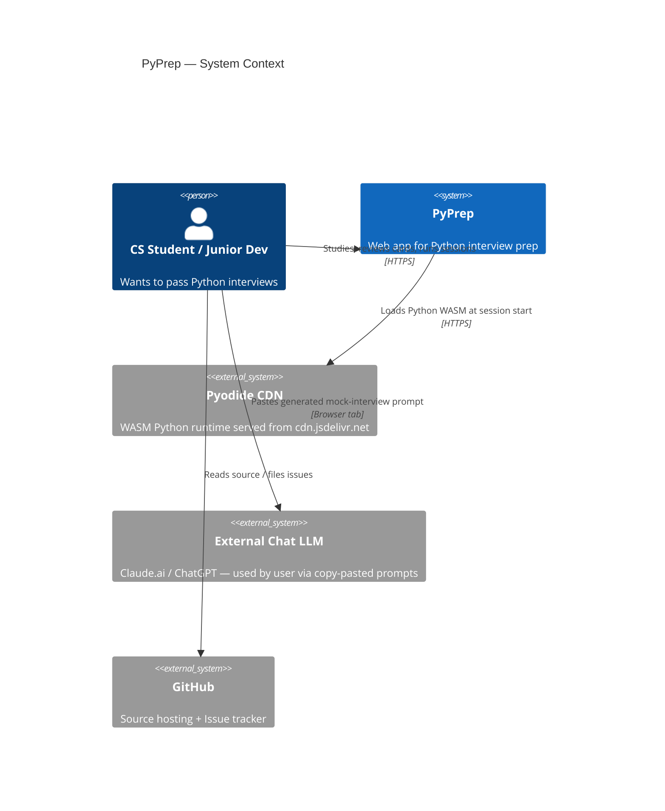
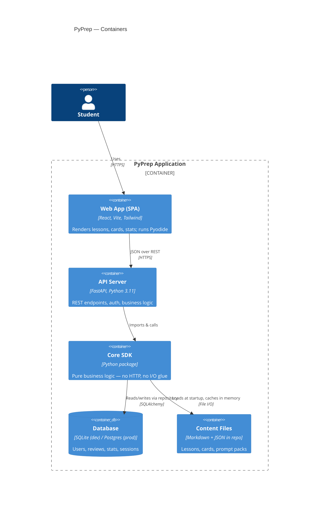
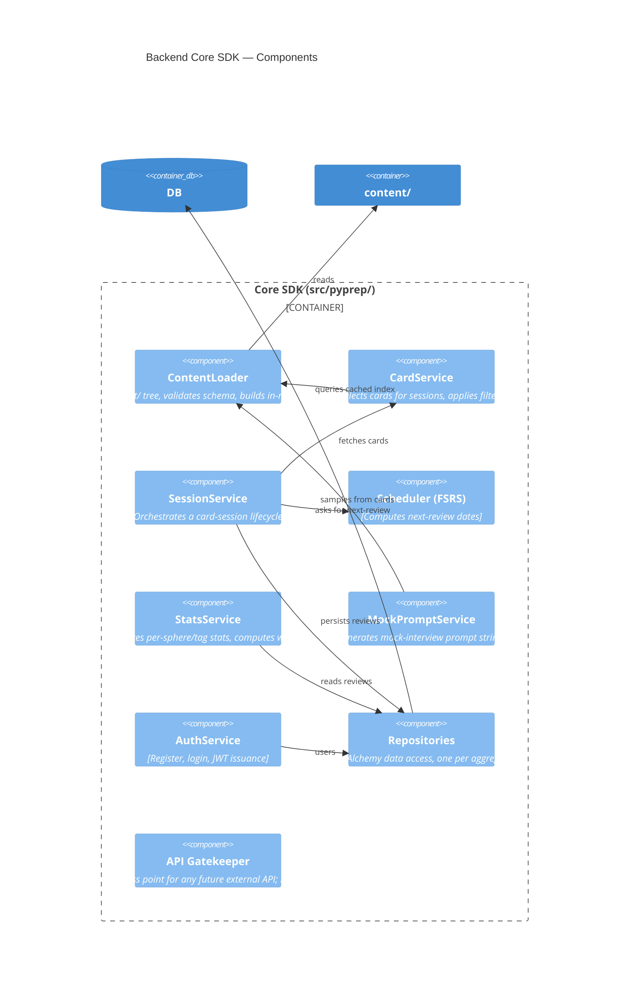
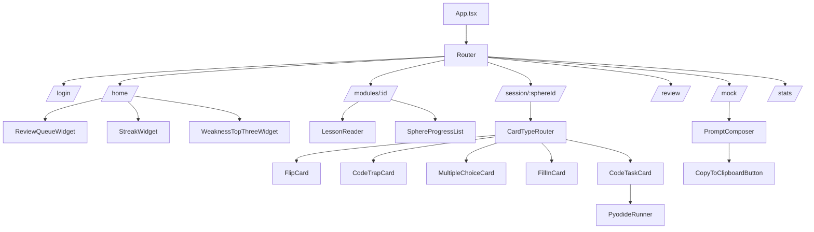
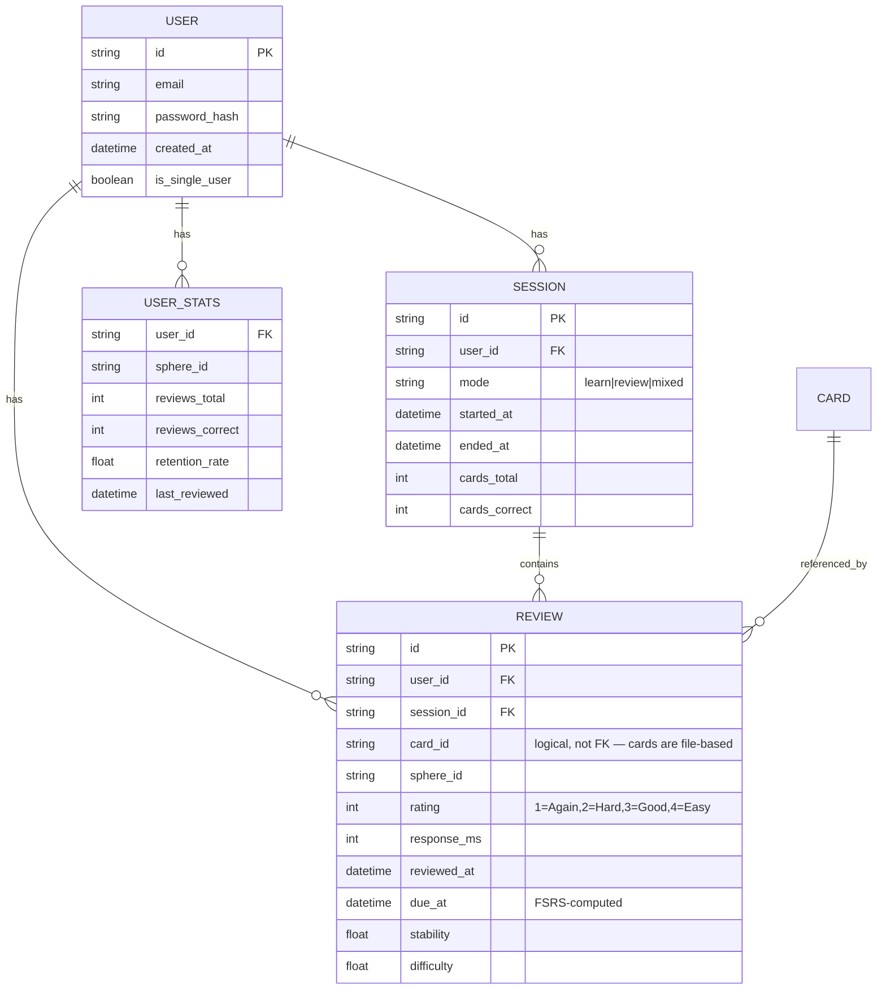
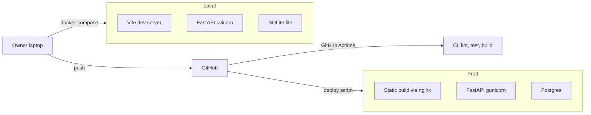

# PyPrep — Architecture & Design Document (PLAN)

**Version:** 1.00
**Companion to:** `PRD.md`
**Last updated:** 2026-05-07

---

## 1. C4 Model — Level 1: System Context



**Key insight:** PyPrep does not call any paid LLM API. The mock interview feature generates text prompts the user pastes into their own LLM browser tab.

---

## 2. C4 Model — Level 2: Containers



---

## 3. C4 Model — Level 3: Backend Components (Core SDK)



### 3.1 SDK Layer Rule (Segal §3.1)

All consumers — REST handlers, future CLI, tests — talk to the SDK. **No** business logic lives in REST handlers. A handler should be at most ~10 lines: parse request → call SDK → format response.

---

## 4. Frontend Architecture



### 4.1 State Management

- **Server state**: TanStack Query for everything from the API.
- **UI state**: React local state + a small Zustand store for cross-route ephemeral state (current session progress).
- **No Redux.** Overkill for this scope.

### 4.2 Pyodide Loading Strategy

- Lazy-load Pyodide only when a route that needs it is opened (`/session/...` for code tasks).
- Cache the loaded interpreter for the SPA lifetime.
- Run user code + hidden `pytest` harness in a Web Worker to keep main thread responsive.

---

## 5. Data Model



**Card content is NOT stored in the DB.** Cards live in `content/` as files, loaded once at startup and addressed by stable string IDs. This keeps content version-controlled in Git and editable without DB migrations.

**FK ON DELETE behavior** (T2.10): user-rooted aggregates use
`ON DELETE CASCADE`. Deleting a `User` row cascades through
`sessions` (where `user_id` FKs to `users.id`) and `reviews` (where
both `user_id` and `session_id` FK with cascade). This is the
GDPR-aligned default — full account wipe on user deletion. SQLite
enforces FKs only when `PRAGMA foreign_keys=ON` is set per-connection;
Postgres enforces unconditionally. The Phase 3 DB-init code is
responsible for setting the SQLite pragma.

**`USER_STATS` is intentionally not built.** PRD progress §3.3
supersedes the `USER_STATS` row in the diagram above: stats are
computed on-the-fly from `reviews` at MVP. Materialized views are
post-MVP.

---

## 6. Architectural Decision Records (ADRs)

### ADR-001: Pyodide for code execution, not server-side `exec`

**Status:** Accepted

**Context:** Users will write and run Python code as part of code-task cards. The two viable approaches: server-side execution in a sandbox (Docker container per user), or client-side via Pyodide (Python compiled to WASM, runs in browser).

**Decision:** Client-side via Pyodide. No server-side execution under any circumstances.

**Rationale:**
- Zero attack surface from user code on the server.
- Zero infra cost for code execution.
- pytest-via-Pyodide works (proven by JupyterLite and similar projects).
- Initial Pyodide load (~10 MB) is acceptable for a focused study session.

**Trade-offs:**
- Some Python packages don't work in Pyodide (compiled extensions). Mitigated: code-task cards target stdlib + a curated allowlist.
- First load is slow. Mitigated: lazy-load only on code-task routes; cache for session.

### ADR-002: FSRS over SM-2 for spaced repetition

**Status:** Accepted

**Context:** Spaced repetition algorithm choice. SM-2 (used by Anki classic) is well-known; FSRS (Free Spaced Repetition Scheduler) is a modern ML-fit replacement now also used by Anki.

**Decision:** FSRS via the `fsrs` library (PyPI; GitHub repo: open-spaced-repetition/py-fsrs).

**Rationale:**
- FSRS is more accurate per published benchmarks; produces fewer wasted reviews.
- It is the current default in modern Anki, so users with prior Anki habits map cleanly.
- `fsrs` is small, well-tested, and pure Python.

**Trade-offs:**
- Slightly more state per review (stability + difficulty floats). Acceptable.
- Algorithm is harder to explain in interviews than SM-2. Acceptable — we wrap it in `Scheduler` interface.

### ADR-003: SQLite for dev, Postgres path for prod

**Status:** Accepted

**Context:** Choose persistent store. Options: SQLite, Postgres, MongoDB.

**Decision:** SQLAlchemy ORM with SQLite for local single-user mode and Postgres-compatible URL support for shared deployments.

**Rationale:**
- SQLite is zero-config for the owner's local install.
- SQLAlchemy abstraction keeps the upgrade path to Postgres trivial.
- No NoSQL fit — data is highly relational (users, reviews, sessions).

### ADR-004: Content as files, not DB rows

**Status:** Accepted

**Context:** Where do lessons and cards live?

**Decision:** Markdown for lessons, JSON for card definitions, in `content/` directory under version control.

**Rationale:**
- Content is editable in any IDE; no admin UI needed for MVP.
- Diff-able in Git, reviewable as PRs.
- Loaded once into in-memory index at server start; query is O(1).
- Avoids building an admin CMS, which would double the project scope.

**Trade-offs:**
- Non-technical contributors can't edit content. Acceptable — the only contributor at MVP is the owner.

### ADR-005: Mock interview as prompt generator, not as in-app LLM call

**Status:** Accepted (per owner directive)

**Context:** Mock interviews would normally require an LLM API call.

**Decision:** Generate the prompt text and let the user paste it into their own Claude/ChatGPT browser tab.

**Rationale:**
- Zero API cost.
- User reuses an existing chat subscription.
- Prompt quality > model choice at this scale.
- No API key management, no rate limits, no cost monitoring.

**Trade-offs:**
- UX is slightly less polished (copy-paste step). Mitigated: clear "How to use" panel.
- App cannot grade the mock. Acceptable — the LLM acts as judge.

### ADR-006: `uv` as the only package manager

**Status:** Accepted (Segal §16.4)

**Context:** Python tooling: pip, poetry, pdm, uv, conda.

**Decision:** `uv` exclusively.

**Rationale:**
- Mandated by Segal guidelines.
- Fastest installer in the ecosystem.
- Lockfile (`uv.lock`) ensures reproducibility.
- One tool for venv + install + lock + run.

### ADR-007: FastAPI over Flask/Django

**Status:** Accepted

**Context:** Backend framework.

**Decision:** FastAPI.

**Rationale:**
- Owner's existing stack (Digi-Ktav was FastAPI).
- Type-hint native; Pydantic models = free request validation.
- Async support if needed later.
- OpenAPI docs auto-generated → useful as portfolio artifact.

### ADR-008: React + Vite + TanStack Query + Tailwind, no UI kit

**Status:** Accepted

**Context:** Frontend framework + state + styling.

**Decision:** React 18, Vite, TanStack Query for server state, Tailwind for styling. No Material-UI / Ant Design / Chakra.

**Rationale:**
- Owner's existing stack.
- UI kits add weight and constrain custom card animations (flip).
- Tailwind + a small in-house component library is sufficient.

### ADR-010: Stateless session server; client owns queue progression

**Status:** Accepted

**Context:** During a card session, *something* has to track which card the user is currently on, the order of remaining cards, and the FR-REVIEW-3 rule that AGAIN-rated cards re-enter the queue at end of session. Two designs are viable: (a) server-authoritative — `SessionService` owns a mutable in-memory queue per session, every `submit` advances it, every refresh re-fetches the next card; (b) stateless — the server picks the initial queue at `start`, records each `Review` event independently, and the SPA owns progression and re-Again ordering.

**Decision:** Stateless. The server is an event-sink for `Review` rows. The SPA owns queue ordering and the AGAIN-reinsertion loop.

**Rationale:**
- **Hard Rule 2 thin handlers.** Server-authoritative queues would push handlers past the ~10-LOC budget once you add session-locking, queue-snapshot persistence, and stale-cursor guards.
- **Single-user MVP.** No adversarial attacker model — there is no incentive for the user to deviate from their assigned queue, and no leaderboard or competitive context where deviation would be cheating.
- **Trivial crash recovery.** A page refresh re-requests `/api/review/queue` (or re-runs `start`) — no server-side cursor to reconcile.
- **FR-REVIEW-3 is a "what to show next" concern, not a business invariant.** The truth-of-record is the `Review` row's rating; queue ordering is a UX concern.

**Trade-offs (accepted explicitly):**
- Clients **can** deviate from the picked-at-start `Session.queue` — submit a card not in the queue, skip cards, etc. Server validates the card_id exists and the session is open; that's it.
- `mixed` mode (FR-REVIEW-4 daily-new-card cap + FR-STATS-2 weakness-rank input) is the one place this approximation might bite, because the cap should be an authoritative invariant, not a suggestion. Flagged for re-examination once StatsService lands at T2.5 and queue assembly hits real complexity.

**Revisit when:**
- (a) Multi-user public mode ships and an adversarial attacker model exists.
- (b) Competitive / leaderboard features need anti-cheat invariants.
- (c) Audit-trail requirements force "what cards did the user see and in what order".

Until any of these triggers, stateless stays.

> **ADR-013 amendment (Pyodide trust boundary review trigger):** ADR-010
> already accepts that the SPA can lie to itself (queue deviation). The
> Pyodide pass/fail signal for code-task cards is also client-reported;
> a determined user could submit a fake `RunResult { ok: true }` from
> the browser console. **When competitive/multi-user features
> (leaderboards, public sharing of mock-interview results) are
> introduced, this ADR MUST be revisited.** Two options at that point:
> server-side re-execution under allowlist (a sandbox that re-runs the
> hidden harness against the submitted user_code), OR cryptographic
> attestation of the in-browser run (signed RunResult with a server-
> side nonce). Until any of ADR-010's triggers fire, we accept that the
> client is the source of truth for code-task outcomes — same trade-off
> as queue progression, single-user MVP rationale.

---

### ADR-009: FSRS fuzzing disabled for output determinism

**Status:** Accepted

**Context:** `fsrs.Scheduler` defaults to `enable_fuzzing=True`, which jitters the next due-date by a small random offset. PRD `PRD_spaced_repetition.md` §2.5 requires byte-identical output for identical input — golden vectors and snapshot tests depend on it.

**Decision:** `FSRSScheduler` instantiates the underlying scheduler with `enable_fuzzing=False`. The choice is hard-coded in the wrapper, not configurable.

**Rationale:**
- Determinism is a stronger property than load-spreading at our scale (single-digit users in MVP).
- Snapshot/golden tests (PRD §4.3) require byte-identical replay.
- Stability/difficulty trajectories are still produced by FSRS-6's actual algorithm — only the per-due jitter is suppressed.

**Trade-offs:**
- At high scale (many users × thousands of cards), unjittered due-dates may cluster review load on the same UTC days. Mitigation if/when that becomes real: re-enable fuzzing with a deterministic per-user seed (pass a seed into the scheduler so identical-user-identical-card replay still matches snapshots).

---

### ADR-011: JWT in localStorage for MVP-1 (single-user, self-hosted)

**Status:** Accepted (added Phase 3.5 — owner verdict)

**Context:** The SPA needs to store the bearer token between page loads.
Two viable strategies:
1. **localStorage** — synchronous, simple, but XSS-extractable.
2. **httpOnly cookie + CSRF middleware** — XSS-safe (token not reachable
   from JS) but requires a full CSRF protection layer (double-submit
   token, SameSite=strict tuning, OPTIONS-preflight handling).

**Decision:** localStorage for MVP-1.

**Rationale:**
- Single-user, self-hosted on the owner's laptop. No XSS surface that an
  attacker could realistically reach.
- httpOnly+CSRF would add ~1 day of cookie/CSRF middleware work — disproportionate
  for a single-user app whose only client is the owner.
- Migration path is well-trodden: switch the token issuance to
  `Set-Cookie: HttpOnly; Secure; SameSite=Strict`, add CSRF token
  middleware, change SPA fetch to `credentials: "include"`.

**Trade-offs (accepted explicitly):**
- An XSS bug anywhere in the SPA can read the token from localStorage
  and exfil it. Mitigation: keep CSP strict, never `dangerouslySetInnerHTML`,
  audit dependencies.
- Going public-multi-user without the migration is a real exposure.
  This ADR's review trigger guards against drift.

**Review trigger:** going public-multi-user (any deploy where the
attacker model includes "user A trying to read user B's session").
At that point, switch to httpOnly cookie + CSRF before merging the
multi-user feature.

---

### ADR-012: Production static hosting via FastAPI StaticFiles

**Status:** Accepted (added Phase 3.5 — owner verdict)

**Context:** Two ways to serve the SPA in production:
1. **nginx (or another reverse proxy) serving `frontend/dist`**, FastAPI
   on a separate port behind a path or subdomain.
2. **FastAPI itself mounting `frontend/dist` via Starlette `StaticFiles`**.

**Decision:** Single-process FastAPI + StaticFiles in production.
Vite dev server stays separate (port 5173) in dev.

**Rationale:**
- Single process, single deployment artifact, single TLS cert. Owner
  hosts on a $5 VPS — minimal ops surface beats theoretical perf gain.
- Same-origin in production → CORS becomes a no-op (no preflight, no
  `Access-Control-*` headers needed). `PYPREP_CORS_ORIGINS` only
  matters in dev when the SPA runs on a different port.
- Static-file throughput at PyPrep's traffic levels (single-digit users)
  is far below where FastAPI/uvicorn becomes a bottleneck.

**Trade-offs:**
- nginx in front would give better gzip/brotli + cache-header tuning
  out of the box. Acceptable: Phase 10 deploy guide can layer Caddy or
  Cloudflare in front if perf becomes a concern.
- A bug in a FastAPI route could OOM-crash the static-file server too.
  Acceptable for MVP scale.

**Implementation notes** (Phase 10):
- `app.mount("/", StaticFiles(directory="frontend/dist", html=True), name="spa")`
  AFTER all `/api/*` routers are registered (FastAPI matches in order).
- `index.html` fallthrough for SPA routing: handled by `html=True`.
- Production CORS config: `cors_origins=[]` or empty → CORSMiddleware
  no-ops (same-origin requests need no CORS headers).
- TODO.md Phase 10 (T10.3) updated to call out this StaticFiles mount.

**Migrations amendment (T4.2 unblock, audit Section D #2):** the
production deploy used to need a separate `alembic upgrade head` step
before the app process started — easy to forget, easy to break. As of
T4.2-unblock the FastAPI lifespan runs `alembic upgrade head` at
startup (idempotent, no-op when DB is at head). Production deploy is
now: drop a new build, restart the process, schema follows. No manual
migration step in the Dockerfile / deploy guide. The Phase 10
deploy-guide (T10.4) should NOT recommend a separate alembic step.

---

### ADR-013: See ADR-010 amendment (Pyodide client-side trust boundary)

**Status:** Accepted (Phase 3.5 amendment to ADR-010)

The full text lives inside ADR-010 above as a quoted amendment block.
ADR-013 is a stub here for cross-reference: the Pyodide pass/fail signal
for code-task cards is client-reported and trusted under the same
single-user MVP rationale as ADR-010's queue progression. Same review
triggers apply.

---

### ADR-014: Public /api/config for SPA boot-time deployment-mode detection

**Status:** Accepted (added Phase 4 — owner verdict)

**Context:** The SPA needs to know at boot time whether the deployment
is in single-user mode so it can either skip the login screen entirely
(token present) or pre-fill the login email and disable the field
(token absent). Three options:

1. **Public `GET /api/config`** returning `{single_user: bool, version: str}`.
   Clean, small surface, explicitly public.
2. **Probe via `GET /api/auth/me` without token.** Conflates auth-check
   with config-read; awkward error semantics (401 means "no token" or
   "config probe failed"?).
3. **Bake `VITE_SINGLE_USER=true` into the frontend build.** Frontend
   and backend must be deployed in lockstep; a misconfigured deploy
   silently drifts.

**Decision:** Option (1) — add `GET /api/config` as a PUBLIC endpoint
(no auth required). Response shape:

```
{ single_user: bool, version: str, single_user_email: str | null }
```

`single_user_email` is **only** populated when `single_user=true`; it
is `null` in multi-user deployments. The field is needed because the
SPA pre-fills (and disables) the email input in single-user mode per
the T4.2 spec — the owner already knows their own email, and a
single-user deployment by definition has no enumeration surface
(there is exactly one possible user, so revealing it tells an
attacker only what they could guess from the deployment hostname).

**Rationale:**
- Keeps backend as the source of truth; frontend cannot drift.
- Tiny surface area — single new endpoint, single new Pydantic response,
  no SDK additions needed (reads `Settings.single_user` directly).
- Public is correct: `single_user` is not a secret (it's observable
  from `/api/auth/register` returning 404), and `version` is already
  in `/api/health`.

**Trade-offs (accepted):**
- One extra HTTP round-trip on app boot (parallelizable with
  `/api/health` smoke). Negligible.
- A future "config gets per-user fields" temptation must be resisted.
  Per-user config goes through `/api/auth/me` (auth-gated), not here.
  Anything in `/api/config` is observable to anonymous callers and
  must stay public-safe forever.

**Multi-user mode preserves anti-enumeration.** When `single_user=false`,
`single_user_email` is `null` — the public endpoint exposes only
`single_user` (false) and `version`. Multi-user enumeration via
`/api/config` is not possible.

---

### ADR-015: FSRS rating policy on objective cards — show correctness, then self-rate

**Status:** Accepted (added Phase 5 — owner verdict)

**Context:** Four of the five card types (`multiple_choice`, `code_trap`, `fill_in`, `code_task`) have an objective right/wrong outcome. After the user submits, the card knows whether they were correct. Two policies for converting that outcome into the FSRS rating (`Again|Hard|Good|Easy`) sent to `POST /api/sessions/{id}/answer`:

1. **Auto-rate on correctness.** Wrong → `Again` automatically; correct → `Good` automatically. User may override. Anki convention.
2. **Show correctness, then self-rate.** Card reveals correct/incorrect (with explanation), then surfaces the same `RatingBar` that flip-cards use. User picks the rating themselves.

**Decision:** Option (2) — show correctness, then always self-rate. Every card type ends in the same RatingBar regardless of how the answer was checked.

**Rationale:**
- **Captures intent better than auto-rating.** A correct multiple-choice click might mean "I knew it cold" (Easy) or "I narrowed it to two and guessed right" (Hard). An incorrect fill-in might mean "I forgot the syntax" (Again) or "I knew it but misclicked / typoed" (Hard). Auto-rating throws this signal away.
- **Stays consistent with the flip-card path.** `flip` cards have no objective outcome; they require self-rating by definition. Forcing the same RatingBar across all five types means one motor pattern, one keyboard map, one set of FSRS implications for the user to learn.
- **Audience.** PyPrep users are technical adults preparing for interviews — they have the metacognition to self-assess and benefit from the agency. Anki's auto-rate convention exists partly because Anki's audience includes language learners and trivia memorizers who benefit from less choice.

**API impact:** None. `AnswerRequest.rating` stays the only signal; no `outcome: 'correct'|'wrong'` field is added. Whether the user got it objectively right is a UX-layer concern (drives the reveal + explanation) but never reaches the server.

**Trade-offs (accepted explicitly):**
- One extra click per objective card vs auto-rate. Acceptable — keyboard shortcut (1/2/3/4) makes it ~zero-cost for power users.
- Inconsistent ratings vs objective outcomes are possible (user clicks `Easy` on a wrong answer). FSRS will schedule accordingly; this is by design — user sovereignty over their own scheduling beats imposing a "correct" mapping.

**Revisit when:** A study shows objective auto-rate yields measurably better retention than self-rate for this audience, OR the rating-step latency becomes the dominant per-card time cost (it won't — reveal + reading the explanation dominates).

---

### ADR-016: Per-card React isolation via `key={card.id}`

**Status:** Accepted (added Phase 5)

**Context:** A session renders one card at a time inside `<SessionPage>`. When the user advances, the next card mounts in the same DOM slot. React, by default, would reuse the existing component instance if the component type is the same (e.g. two consecutive `<MultipleChoiceCard>` renders), preserving local `useState` between cards. This is wrong: the chosen MC option, the fill-in input value, the editor scroll position, the reveal-state-toggle — all of these MUST reset between cards. Two ways to enforce reset:

1. **Manually clear state in a `useEffect` on `card.id` change.** Easy to forget for new fields; depends on every renderer remembering to wire the effect.
2. **`<CardRenderer key={card.id} ... />`.** React unmounts the old tree and mounts a fresh one whenever the key changes. State cannot leak by construction.

**Decision:** Option (2). Every card-type render in `<SessionPage>` is keyed on `card.id`. New card → new component instance → fresh state, guaranteed.

**Rationale:**
- **By construction beats by convention.** Eliminates a class of bug (intermediate state from card N visible during card N+1) at the framework level rather than at every renderer's discipline.
- **Mirrors the Phase 6 Pyodide-isolation rule.** PRD_code_sandbox §FR-SBX-6 requires Python globals to reset between code-task runs. Same mental model, different layer: each card is a fresh render *and* a fresh Python namespace. ADR-016 (frontend) and the Phase 6 ADR (Pyodide runner) reinforce each other.
- **Cheap.** React 19 mount/unmount of a typical card subtree is sub-millisecond; no perceptible cost.

**Trade-offs:** None material. The "smooth transition between cards" PR a future contributor might write would have to deliberately route around this — and the ADR documents why not to.

**Revisit when:** Card-mount cost becomes measurably perceptible (e.g. with an embedded CodeMirror instance that takes >50ms to construct). At that point, isolate state via `useEffect`-on-id-change inside the offending renderer rather than removing the global key.

---

### ADR-017: Session URL nesting + no MVP resumption

**Status:** Accepted (added Phase 5 — owner verdict)

**Context:** Two coupled questions for the Phase 5 session route:

(a) **URL shape.** `/session/$sphereId` (short, sphere-only) vs `/modules/$moduleId/sphere/$sphereId/session` (nested, mirrors lesson route hierarchy)?
(b) **Resumability.** If the user navigates away mid-session and comes back, do we resume the in-flight session or start a fresh one?

**Decision:**
- **(a) Nested.** `/modules/$moduleId/sphere/$sphereId/session`.
- **(b) No resumption in MVP.** Each navigation to the session route issues a fresh `POST /api/sessions`. In-flight sessions are abandoned silently (no `finish` call); the server tracks them as `ended_at IS NULL` rows that are ignored by stats.

**Rationale (a):**
- **Sphere IDs are not globally unique.** `m1-s0` and `m2-s0` will collide once Module 2 ships (Phase 9). Nested route makes the address explicit.
- **Mirrors the lesson route hierarchy.** Users already navigate `/modules/$moduleId/sphere/$sphereId/lesson`; placing the session at the same depth keeps the URL bar consistent and readable.
- **Breadcrumbs.** Nested route lets the AppShell render `Module 1 > Sphere m1-s0 > Session` deterministically without a sphere → module reverse lookup.

**Rationale (b):**
- **A session is a user-conscious commitment.** The user sits down to do "20 cards" with intent; silently dropping them back into a stale session 3 days later is confusing, not helpful. The "I'm starting now" framing protects flow.
- **Backend already supports stateless restart.** Per ADR-010 the server is an event-sink; a fresh `POST /api/sessions` is the natural boundary, no special logic needed.
- **Correctness is preserved either way.** Reviews already submitted from the abandoned session are real `Review` rows and feed FSRS regardless of whether `finish` was called.

**Forward-looking note:** When a Phase 7 home dashboard becomes interactive, an "in-progress session" banner with a resume CTA is the right surfacing — don't auto-resume silently. The user makes the choice; the dashboard shows it exists.

**Trade-offs (accepted explicitly):**
- Network cost of a small-but-real `POST /api/sessions` per navigation. Negligible (single insert, no FSRS recomputation).
- Orphan in-flight sessions accumulate as `ended_at IS NULL` rows. Acceptable in MVP-1; a Phase 10 cleanup job (or a scheduled `auto-finish` after 24h of inactivity) can sweep them once the volume matters.

**Revisit when:** Owner reports losing significant session progress to accidental tab closes (signal that resumption UX would matter), OR multi-user load makes orphan-session accumulation a real cost.

---

## 7. API Surface (preview)

Authoritative spec lives in OpenAPI auto-generated at `/api/docs`. High-level shape:

```
POST   /api/auth/register                  # auth: none (404 in single-user mode)
POST   /api/auth/login                     # auth: none
POST   /api/auth/refresh                   # auth: Bearer (rotates jti per call)
GET    /api/auth/me                        # auth: Bearer    {id, email, created_at}

GET    /api/modules                        # auth: PUBLIC  (T3.5.7 — locked by test)
GET    /api/modules/{module_id}            # auth: PUBLIC
GET    /api/modules/{module_id}/lesson/{sphere_id}   # auth: PUBLIC

POST   /api/sessions                       # auth: Bearer    start session
GET    /api/sessions/{session_id}/next     # auth: Bearer    next card (stateless)
POST   /api/sessions/{session_id}/answer   # auth: Bearer    submit rating + outcome
POST   /api/sessions/{session_id}/finish   # auth: Bearer    idempotent

GET    /api/review/queue                   # auth: Bearer    today's FSRS queue
GET    /api/stats/me                       # auth: Bearer    full stats
GET    /api/stats/me/weakness              # auth: Bearer    top-N weakest spheres

POST   /api/mock/prompt                    # auth: Bearer    body: {modules, spheres, ...}
                                           #                 returns: {text, cards_used, ...}

GET    /api/health                         # auth: PUBLIC    smoke: {status, version, db_ok}
GET    /api/config                         # auth: PUBLIC    {single_user, version, single_user_email | null} (ADR-014)
```

**Auth-tag legend.** *PUBLIC* = no Authorization header required;
locked by integration test so a future "require auth" change is a
deliberate test diff, not silent drift. *Bearer* = `Authorization:
Bearer <jwt>` required; missing/malformed/expired → 401 with
`WWW-Authenticate: Bearer`. Module catalog and lessons are PUBLIC
because content is non-secret (also visible in the repo); the per-user
state behind every other endpoint is Bearer-gated.

---

## 8. Deployment



Single `docker-compose.yml` orchestrates dev. Production deploy is post-MVP.

---

## 9. Cross-Cutting Concerns

- **Logging:** structured JSON via `structlog`. Levels: DEBUG/INFO/WARN/ERROR. No `print` (Segal §6.2).
- **Config:** `pydantic-settings` reads from env vars / `.env`. Never hardcoded.
- **Testing:** pytest, fixtures in `tests/conftest.py`, mocking via `unittest.mock`. Coverage gate ≥ 85%.
- **Linting:** `ruff check` + `ruff format`. Zero violations gate.
- **Pre-commit:** ruff, mypy strict on `src/pyprep/sdk/`, conventional-commits.
- **Versioning:** semver, starting at `1.00` per Segal §17 ref.

---

## 10. Risks & Mitigations

| Risk | Likelihood | Impact | Mitigation |
|---|---|---|---|
| Pyodide compatibility issues for some Python idioms | Med | Med | Curate allowlist of stdlib modules per code-task; document |
| Content authoring drags out | High | High | Module 1 hand-authored as gold; later modules use AI generation + owner review |
| Scope creep into a generic Anki replacement | Med | High | PRD §5 hard-bounds scope; reject features that don't serve interview prep |
| Owner stops using the tool he built | Low | Critical | Build ergonomic owner-mode (single-user, instant-login) early |
| LLM-generated prompts produce low-quality interviews | Med | Med | Prompt template iteratively tuned by running real mocks; v1 is a known-good template |
