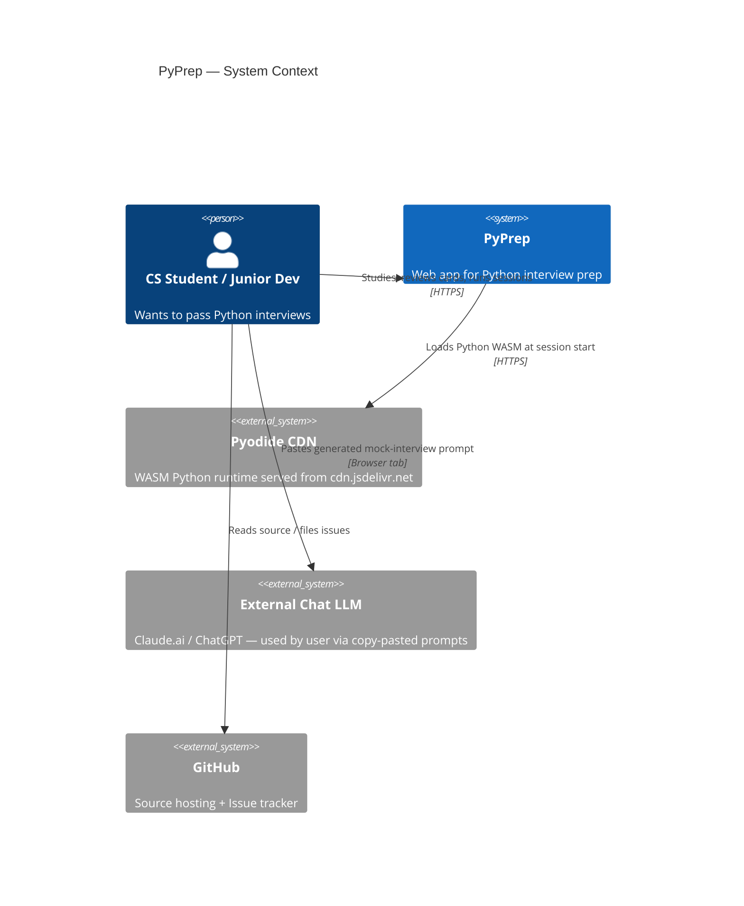
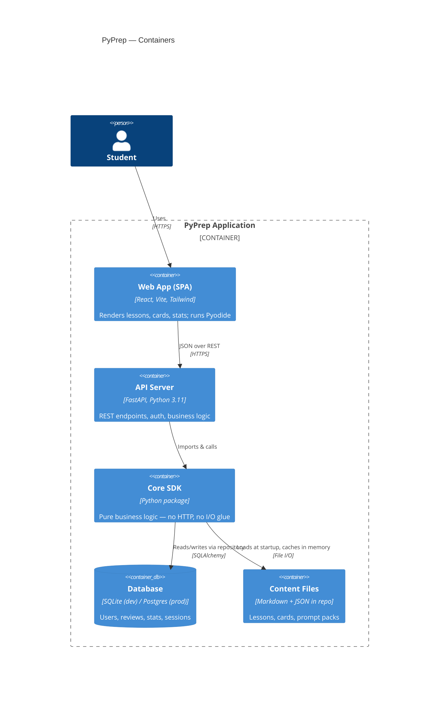
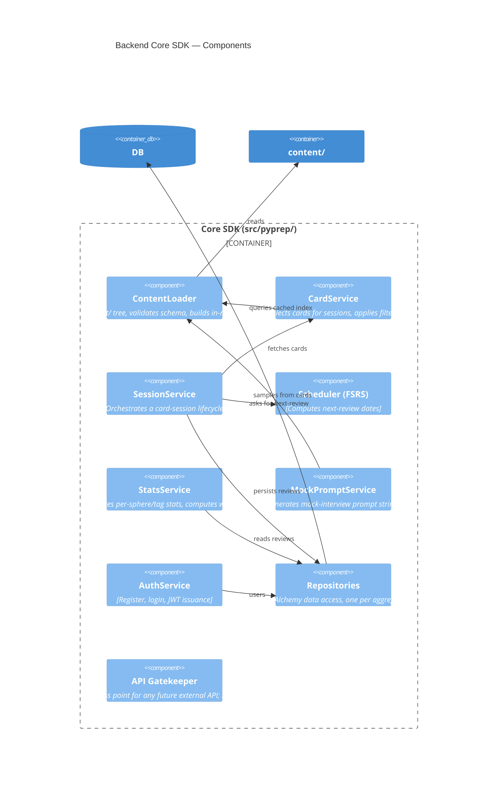
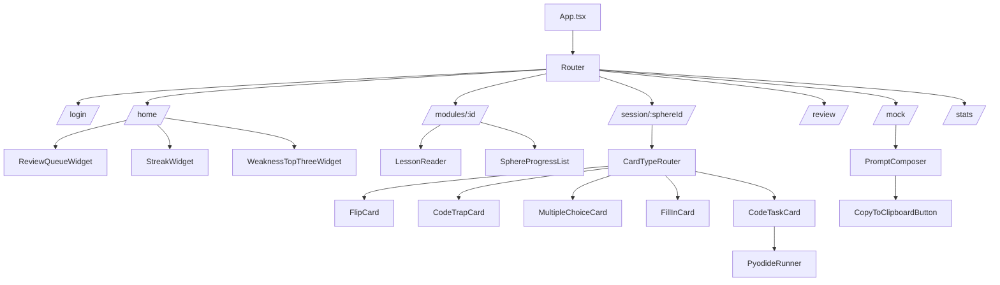
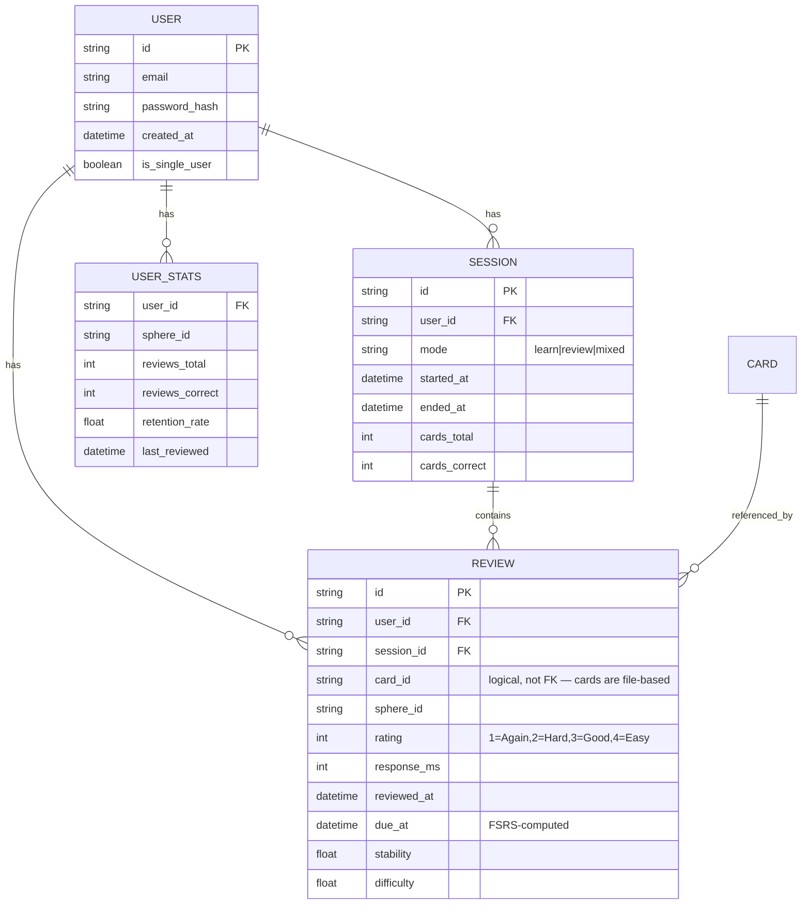
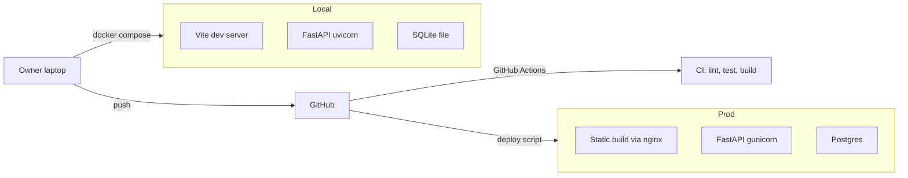

# PyPrep — Architecture & Design Document (PLAN)

**Version:** 1.00
**Companion to:** `PRD.md`
**Last updated:** 2026-05-07

---

## 1. C4 Model — Level 1: System Context



**Key insight:** PyPrep does not call any paid LLM API. The mock interview feature generates text prompts the user pastes into their own LLM browser tab.

---

## 2. C4 Model — Level 2: Containers



---

## 3. C4 Model — Level 3: Backend Components (Core SDK)



### 3.1 SDK Layer Rule (Segal §3.1)

All consumers — REST handlers, future CLI, tests — talk to the SDK. **No** business logic lives in REST handlers. A handler should be at most ~10 lines: parse request → call SDK → format response.

---

## 4. Frontend Architecture



### 4.1 State Management

- **Server state**: TanStack Query for everything from the API.
- **UI state**: React local state + a small Zustand store for cross-route ephemeral state (current session progress).
- **No Redux.** Overkill for this scope.

### 4.2 Pyodide Loading Strategy

- Lazy-load Pyodide only when a route that needs it is opened (`/session/...` for code tasks).
- Cache the loaded interpreter for the SPA lifetime.
- Run user code + hidden `pytest` harness in a Web Worker to keep main thread responsive.

---

## 5. Data Model



**Card content is NOT stored in the DB.** Cards live in `content/` as files, loaded once at startup and addressed by stable string IDs. This keeps content version-controlled in Git and editable without DB migrations.

---

## 6. Architectural Decision Records (ADRs)

### ADR-001: Pyodide for code execution, not server-side `exec`

**Status:** Accepted

**Context:** Users will write and run Python code as part of code-task cards. The two viable approaches: server-side execution in a sandbox (Docker container per user), or client-side via Pyodide (Python compiled to WASM, runs in browser).

**Decision:** Client-side via Pyodide. No server-side execution under any circumstances.

**Rationale:**
- Zero attack surface from user code on the server.
- Zero infra cost for code execution.
- pytest-via-Pyodide works (proven by JupyterLite and similar projects).
- Initial Pyodide load (~10 MB) is acceptable for a focused study session.

**Trade-offs:**
- Some Python packages don't work in Pyodide (compiled extensions). Mitigated: code-task cards target stdlib + a curated allowlist.
- First load is slow. Mitigated: lazy-load only on code-task routes; cache for session.

### ADR-002: FSRS over SM-2 for spaced repetition

**Status:** Accepted

**Context:** Spaced repetition algorithm choice. SM-2 (used by Anki classic) is well-known; FSRS (Free Spaced Repetition Scheduler) is a modern ML-fit replacement now also used by Anki.

**Decision:** FSRS via the `fsrs` library (PyPI; GitHub repo: open-spaced-repetition/py-fsrs).

**Rationale:**
- FSRS is more accurate per published benchmarks; produces fewer wasted reviews.
- It is the current default in modern Anki, so users with prior Anki habits map cleanly.
- `fsrs` is small, well-tested, and pure Python.

**Trade-offs:**
- Slightly more state per review (stability + difficulty floats). Acceptable.
- Algorithm is harder to explain in interviews than SM-2. Acceptable — we wrap it in `Scheduler` interface.

### ADR-003: SQLite for dev, Postgres path for prod

**Status:** Accepted

**Context:** Choose persistent store. Options: SQLite, Postgres, MongoDB.

**Decision:** SQLAlchemy ORM with SQLite for local single-user mode and Postgres-compatible URL support for shared deployments.

**Rationale:**
- SQLite is zero-config for the owner's local install.
- SQLAlchemy abstraction keeps the upgrade path to Postgres trivial.
- No NoSQL fit — data is highly relational (users, reviews, sessions).

### ADR-004: Content as files, not DB rows

**Status:** Accepted

**Context:** Where do lessons and cards live?

**Decision:** Markdown for lessons, JSON for card definitions, in `content/` directory under version control.

**Rationale:**
- Content is editable in any IDE; no admin UI needed for MVP.
- Diff-able in Git, reviewable as PRs.
- Loaded once into in-memory index at server start; query is O(1).
- Avoids building an admin CMS, which would double the project scope.

**Trade-offs:**
- Non-technical contributors can't edit content. Acceptable — the only contributor at MVP is the owner.

### ADR-005: Mock interview as prompt generator, not as in-app LLM call

**Status:** Accepted (per owner directive)

**Context:** Mock interviews would normally require an LLM API call.

**Decision:** Generate the prompt text and let the user paste it into their own Claude/ChatGPT browser tab.

**Rationale:**
- Zero API cost.
- User reuses an existing chat subscription.
- Prompt quality > model choice at this scale.
- No API key management, no rate limits, no cost monitoring.

**Trade-offs:**
- UX is slightly less polished (copy-paste step). Mitigated: clear "How to use" panel.
- App cannot grade the mock. Acceptable — the LLM acts as judge.

### ADR-006: `uv` as the only package manager

**Status:** Accepted (Segal §16.4)

**Context:** Python tooling: pip, poetry, pdm, uv, conda.

**Decision:** `uv` exclusively.

**Rationale:**
- Mandated by Segal guidelines.
- Fastest installer in the ecosystem.
- Lockfile (`uv.lock`) ensures reproducibility.
- One tool for venv + install + lock + run.

### ADR-007: FastAPI over Flask/Django

**Status:** Accepted

**Context:** Backend framework.

**Decision:** FastAPI.

**Rationale:**
- Owner's existing stack (Digi-Ktav was FastAPI).
- Type-hint native; Pydantic models = free request validation.
- Async support if needed later.
- OpenAPI docs auto-generated → useful as portfolio artifact.

### ADR-008: React + Vite + TanStack Query + Tailwind, no UI kit

**Status:** Accepted

**Context:** Frontend framework + state + styling.

**Decision:** React 18, Vite, TanStack Query for server state, Tailwind for styling. No Material-UI / Ant Design / Chakra.

**Rationale:**
- Owner's existing stack.
- UI kits add weight and constrain custom card animations (flip).
- Tailwind + a small in-house component library is sufficient.

### ADR-009: FSRS fuzzing disabled for output determinism

**Status:** Accepted

**Context:** `fsrs.Scheduler` defaults to `enable_fuzzing=True`, which jitters the next due-date by a small random offset. PRD `PRD_spaced_repetition.md` §2.5 requires byte-identical output for identical input — golden vectors and snapshot tests depend on it.

**Decision:** `FSRSScheduler` instantiates the underlying scheduler with `enable_fuzzing=False`. The choice is hard-coded in the wrapper, not configurable.

**Rationale:**
- Determinism is a stronger property than load-spreading at our scale (single-digit users in MVP).
- Snapshot/golden tests (PRD §4.3) require byte-identical replay.
- Stability/difficulty trajectories are still produced by FSRS-6's actual algorithm — only the per-due jitter is suppressed.

**Trade-offs:**
- At high scale (many users × thousands of cards), unjittered due-dates may cluster review load on the same UTC days. Mitigation if/when that becomes real: re-enable fuzzing with a deterministic per-user seed (pass a seed into the scheduler so identical-user-identical-card replay still matches snapshots).

---

## 7. API Surface (preview)

Authoritative spec lives in OpenAPI auto-generated at `/api/docs`. High-level shape:

```
POST   /api/auth/register
POST   /api/auth/login
POST   /api/auth/refresh

GET    /api/modules
GET    /api/modules/{module_id}
GET    /api/modules/{module_id}/lesson/{sphere_id}

POST   /api/sessions                       # start session
GET    /api/sessions/{session_id}/next     # next card
POST   /api/sessions/{session_id}/answer   # submit rating + outcome
POST   /api/sessions/{session_id}/finish

GET    /api/review/queue                   # today's FSRS queue
GET    /api/stats/me                       # full stats
GET    /api/stats/me/weakness              # top-3 weakest spheres

POST   /api/mock/prompt                    # body: {modules, spheres, difficulty}
                                           # returns: {prompt: string, ...}
```

---

## 8. Deployment



Single `docker-compose.yml` orchestrates dev. Production deploy is post-MVP.

---

## 9. Cross-Cutting Concerns

- **Logging:** structured JSON via `structlog`. Levels: DEBUG/INFO/WARN/ERROR. No `print` (Segal §6.2).
- **Config:** `pydantic-settings` reads from env vars / `.env`. Never hardcoded.
- **Testing:** pytest, fixtures in `tests/conftest.py`, mocking via `unittest.mock`. Coverage gate ≥ 85%.
- **Linting:** `ruff check` + `ruff format`. Zero violations gate.
- **Pre-commit:** ruff, mypy strict on `src/pyprep/sdk/`, conventional-commits.
- **Versioning:** semver, starting at `1.00` per Segal §17 ref.

---

## 10. Risks & Mitigations

| Risk | Likelihood | Impact | Mitigation |
|---|---|---|---|
| Pyodide compatibility issues for some Python idioms | Med | Med | Curate allowlist of stdlib modules per code-task; document |
| Content authoring drags out | High | High | Module 1 hand-authored as gold; later modules use AI generation + owner review |
| Scope creep into a generic Anki replacement | Med | High | PRD §5 hard-bounds scope; reject features that don't serve interview prep |
| Owner stops using the tool he built | Low | Critical | Build ergonomic owner-mode (single-user, instant-login) early |
| LLM-generated prompts produce low-quality interviews | Med | Med | Prompt template iteratively tuned by running real mocks; v1 is a known-good template |
